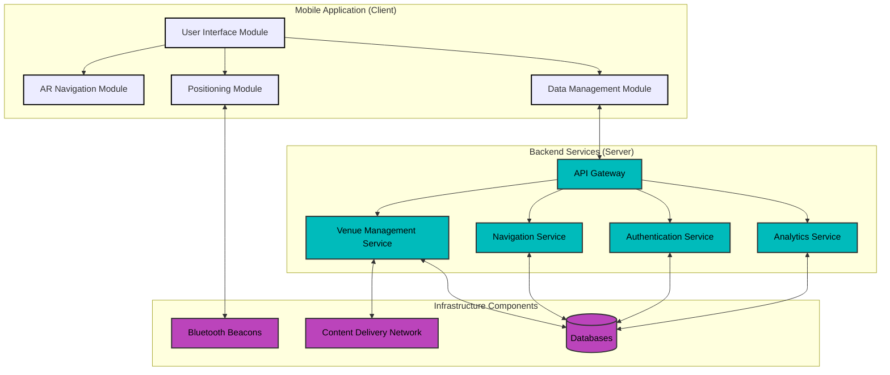
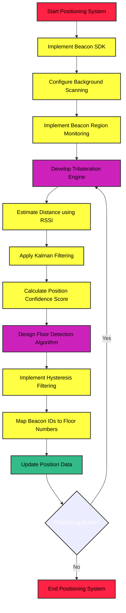
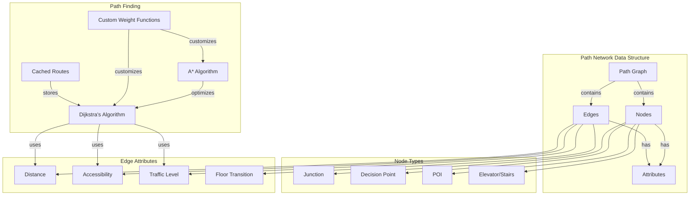
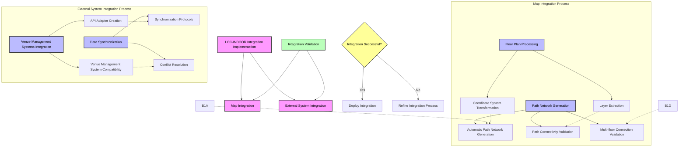

# LOC-INDOOR: Professional Project Report
## Indoor Navigation System with AR Integration

**Author:** TSANGUE VIVIEN BISTREL  
**Date:** 05/06/2025  
**Version:** 1.0

## Executive Summary

LOC-INDOOR is an innovative indoor navigation system that addresses the critical challenge of navigating complex indoor environments where traditional GPS solutions are ineffective. Built with Unity and powered by Minew BeaconSET Plus MBM01 beacons, the system combines Augmented Reality (AR) technology with precise beacon-based positioning to deliver an intuitive, line-based visual guidance system.

The project's primary goal is to revolutionize indoor navigation by providing real-time, AR-based guidance that displays a continuous directional line on the floor through the user's device camera view. This approach, inspired by racing game waypoint systems, makes navigation more intuitive and user-friendly compared to traditional 2D map-based solutions.

Key achievements of the project include:
- Successful integration of AR technology with Bluetooth beacon positioning
- Development of a precise indoor positioning system with accuracy within 1 meter
- Creation of an intuitive line-based navigation interface
- Implementation of real-time path updates and multi-floor navigation
- Establishment of a scalable architecture supporting various venue types

The system is particularly effective in complex environments such as airports, shopping malls, and hospitals, where traditional navigation methods often fall short. By leveraging Unity's AR Foundation and the Minew BeaconSET Plus beacons, LOC-INDOOR provides a robust, accurate, and user-friendly solution to indoor navigation challenges.

## 1. Project Context and Motivation

### 1.1 Problem Statement
Indoor navigation presents significant challenges in complex environments where traditional GPS solutions are ineffective. The main challenges include:

1. **Limited Positioning Accuracy**
   - GPS signals cannot penetrate buildings effectively
   - Traditional indoor positioning methods often lack precision
   - Existing solutions struggle to maintain accuracy in multi-floor environments

2. **Poor User Experience**
   - Current solutions rely heavily on 2D maps, which can be confusing
   - Users often struggle to orient themselves in large spaces
   - Traditional navigation methods require constant map checking and interpretation

3. **Accessibility Issues**
   - Many existing solutions don't account for different user needs
   - Navigation systems often fail to provide accessible routes
   - Complex interfaces can be challenging for users with disabilities

4. **Technical Limitations**
   - Inconsistent signal coverage in indoor spaces
   - Limited real-time updates and responsiveness

### 1.2 Project Objectives
The main goals of the LOC-INDOOR project are:

1. **Technical Objectives**
   - Develop a precise indoor positioning system with accuracy within 1 meter.
   - Create a real-time AR navigation system with minimal latency.
   - Ensure reliable performance across different indoor environments.

2. **User Experience Objectives**
   - Provide intuitive, line-based navigation guidance
   - Minimize the learning curve for new users
   - Ensure smooth operation in various lighting conditions

3. **Business Objectives**
   - Create a scalable solution for different venue types
   - Establish a maintainable and extensible architecture
   - Support future platform expansion (iOS)
   - Enable easy venue data management and updates

### 1.3 Target Users
LOC-INDOOR is primarily a B2B (Business-to-Business) solution, targeting venue operators and facility managers who need to provide navigation services to their visitors. The main target users are:

1. **Airport Management**
   - Needs: Efficient passenger flow management
   - Challenges: Complex terminal layouts, multiple floors
   - Use Case: Improving passenger experience

2. **Shopping Mall Operators**
   - Needs: Enhanced visitor experience and increased store visits
   - Challenges: Large spaces, multiple floors, changing store layouts
   - Use Case: Increasing visitor engagement and store foot traffic

3. **Hospital Administrators**
   - Needs: Improved patient and visitor navigation
   - Challenges: Complex building layouts.
   - Use Case: Reducing visitor stress and improving wayfinding


Each target user has specific business needs that influence the system's design and functionality. The solution must be:
- Easily deployable in their facilities
- Simple to maintain and update
- Scalable to their specific venue size
- Cost-effective for their operations

The end users (visitors, patients, shoppers) are the beneficiaries of the system, but the primary customers are the venue operators.

## 2. Project Specifications

### 2.1 Functional Specifications

#### 2.1.1 Introduction

##### 1 Purpose
This functional specification document outlines the detailed requirements and system design for an indoor navigation application that utilizes Augmented Reality (AR) and Bluetooth beacon technology. The system aims to solve the challenge of navigating complex indoor environments by providing intuitive, visual guidance through a mobile application.

##### 2 Project Scope
The project encompasses the development of a mobile application for Android (with plans to expand to iOS) that provides real-time, line-based navigation guidance in indoor spaces where traditional GPS is ineffective. The system will utilize Bluetooth beacons for positioning and Augmented Reality to overlay directional guidance on the user's view of the physical environment. The beacons are placed at specific locations in the building, moreover, they come with their SDK, containing all the desired functionalities. While the basic concept of indoor navigation with beacons exists, our app uses augmented reality to show a clear line on the real floor, guiding people step by step inside buildings. Unlike apps that only use maps or arrows, this is much easier to follow, especially in big places like malls, hospitals, or airports. We use beacons to ensure the line stays in the right place and works well. This makes the navigation more accurate and useful in many different locations.


##### 3 Intended Audience
- Development team
- Project stakeholders
- Potential venue partners
- Investors and funding partners

#### 2.1.2 Project Overview <a name="project-overview"></a>

##### 1 Problem Statement
Users frequently struggle with navigation in complex indoor environments such as airports, shopping malls, hospitals, and large public buildings, This is because the satellite can not detect someone's position inside a building because of walls. Traditional navigation solutions that rely on GPS are ineffective in these spaces.

##### 2 Solution Description
The solution will implement a marker-based floor navigation system with AR overlays, inspired by racing video games like Forza Horizon in Unity. When users 
select a destination within a venue, the application will display a directional line on the floor through their device's camera view, guiding them seamlessly to 
their chosen location. Bluetooth beacons strategically placed throughout the venue will provide precise location data to ensure accurate navigation. The question is why choosing this technology, after a great reflection I find out that other solution make use of 2D view indoor navigation, but since I wanted something more user friendly, The decision of implemening it in Unity AR was the best option.

- Unity has AR Foundation, a cross-platform framework that supports both ARKit (iOS) and ARCore (Android).
- Unity is generally lighter and better optimized for mobile devices, especially low to mid-range smartphones.
- For indoor AR navigation (which needs smooth performance), Unity is less resource-intensive than Unreal Engine.
- Unity has a large ecosystem with many ready-to-use plugins for:
  - Bluetooth beacon integration.
  - Indoor positioning.
  - 2D/3D floor plans.
  - AR UI tools.


#### 2.1.3 User Personas

##### Persona 1: Traveler - Sarah Thompson


##### Persona 2: Mall Shopper - Marcus Johnson


##### Persona 3: Accessibility User - Elena Vasquez


##### Persona 4: Hospital Visitor - Robert Chen


##### Persona 6: First-time Visitor - Mei Chen


#### 2.1.4 User Stories

1. **Airport Navigation**
    - As a traveler in an unfamiliar airport, I want to easily find my connecting gate so that I don't miss my flight.
    - As a passenger arriving at an airport, I want to find the nearest restroom, restaurant, or baggage claim area quickly.

2. **Shopping Mall Navigation**
    - As a shopper, I want to find specific stores or services within a large mall without checking physical directories.
    - As a mall visitor, I want to find the closest exit from my current location.

3. **Hospital/Healthcare Facility Navigation**
    - As a patient or visitor, I want to find specific departments or rooms within a hospital complex.

4. **Special Needs Users**
    - As a user with mobility challenges, I want clear guidance that takes into account accessibility routes.

#### 2.1.5 Use Cases 

##### 5.1 Core Use Cases

###### UC-1: Airport Navigation
**Primary Actor:** Traveler (Sarah)
**Preconditions:**
- User has installed the application
- Airport has deployed beacon infrastructure
- User has granted necessary permissions

**Main Flow:**
1. User opens the application upon arriving at the airport
2. System detects user's location and displays available airport map
3. User searches for their departure gate number
4. System displays gate location on map
5. User selects "Navigate to Gate"
6. System activates AR view showing line on floor to follow
7. User follows the line, which adjusts in real-time as they move
8. System provides notifications for turns and level changes
9. System confirms arrival when user reaches the gate

**Postconditions:**
- User arrives at intended destination
- System logs successful navigation for analytics
- System prompts user for optional feedback

###### UC-2: Shopping Mall Navigation
**Primary Actor:** Mall Shopper (Marcus)
**Preconditions:**
- User has installed the application
- Mall has deployed beacon infrastructure
- Mall directory is updated in the system

**Main Flow:**
1. User enters the mall and opens the application
2. System detects location and displays mall layout
3. User searches for a specific store by name
4. System highlights store location on map
5. User selects "Navigate" option
6. System activates AR view with floor line
7. User follows the displayed path
8. System provides distance updates and directional guidance
9. User arrives at the store

**Postconditions:**
- User arrives at store.
- Navigation session is stored in history.

###### UC-3: Accessible Route Navigation
**Primary Actor:** Accessibility User (Elena)
**Preconditions:**
- User has installed application and set accessibility preferences
- Venue has accessible routes mapped in system
- Beacon infrastructure is installed

**Main Flow:**
1. User opens application in venue
2. System automatically applies accessibility profile
3. User searches for destination
4. System calculates route prioritizing accessible paths, elevators, and ramps
5. User initiates navigation
6. System displays AR guidance with additional accessibility information
7. User follows path optimized for mobility needs
8. System provides advance notice of elevators, ramps, and potential obstacles
9. User successfully navigates to destination

**Postconditions:**
- User arrives at destination via accessible route
- System logs route effectiveness for accessibility
- User can provide feedback on route accessibility

###### UC-4: Hospital Visitor Navigation
**Primary Actor:** Hospital Visitor (Robert Chen)
**Preconditions:**
- User has installed the application
- Hospital has deployed beacon infrastructure
- Visitor has basic patient room information

**Main Flow:**
1. Visitor arrives at hospital parking area and opens the application
2. System detects user's location and displays hospital overview
3. Visitor enters patient information (room number)
4. Visitor selects "Navigate to Patient Room"
5. System calculates optimal route from current location, including entry point selection
6. System activates AR view showing floor line to follow
7. System guides visitor through building entry, security checkpoints, and elevator/stair usage
8. Visitor follows the guided path with clear indicators for building transitions
9. System provides estimated arrival time and notifies visitor upon reaching the correct room

**Postconditions:**
- Visitor successfully locates patient room
- System creates a "frequent route" for easy access during future visits
- Navigation history allows quick return to previously visited locations


##### 5.2 Additional Use Cases

###### UC-5: Multi-Destination Planning
**Primary Actor:** Mall Shopper (Marcus)
**Preconditions:**
- User has application installed
- User is in mapped venue
- User has multiple destinations to visit

**Main Flow:**
1. User opens application and selects "Plan Visit"
2. User adds multiple destinations to visit list
3. System suggests optimal order based on layout
4. User confirms or adjusts order
5. System generates route visiting all destinations efficiently
6. User initiates navigation to first destination
7. Upon arrival, system prompts to continue to next location
8. Navigation continues until all destinations are visited

**Postconditions:**
- User completes all planned destinations
- System logs complete journey
- User can save route for future visits


#### 2.1.6 Functional Requirements 

##### 6.1 Core Functional Requirements

###### FR-1: User Location Detection
- The system determine the user's precise indoor location using Bluetooth beacon technology.
- The system update the user's position in real-time (minimum refresh rate of 1 Hz).
- The system achieve positioning accuracy of at least 0.7 meters in areas with proper beacon coverage.

###### FR-2: Destination Selection
- Display a searchable directory of available destinations within the venue.
- Users can select destinations from categories (Restaurants, Stores, Services, Rooms).
- The system support saving favorite or frequently visited destinations.

###### FR-3: AR Navigation Guidance
- The system displays a continuous directional line on the floor leading from the user's current position to their destination.
- Adjust the displayed path in real-time as the user moves.
- Provide visual cues for turns, elevators, escalators, and other navigation decision points.
- The system display distance to destination and estimated arrival time.

###### FR-4: Multi-floor Navigation
- The system shall guide users between different floors using appropriate vertical transportation (stairs, elevators, escalators).
- The system shall clearly indicate floor transitions in the AR guidance.
- The system shall automatically detect floor changes based on beacon data.

###### FR-5: Route Customization
- Offering route preferences (e.g., shortest path, accessible path).
- Allowing users to avoid specific areas or types of areas.

##### 6.2 Additional Functional Requirements

###### FR-6: Offline Functionality
- The system shall provide navigation functionality even when internet connectivity is limited.

###### FR-7: User Profile and Settings
- The system allow users to create and manage profiles.
- The system support customization of navigation preferences.
- The system shall remember frequently visited locations.

###### FR-8: Accessibility Features
- The system shall support high-contrast modes for visibility.
- The system shall prioritize accessible routes for users who indicate mobility requirements.

#### 2.1.7 Non-Functional Requirements

##### 7.1 Usability Requirements

###### NFR-1: User Interface
- The user interface shall be intuitive and require minimal training for basic navigation tasks.
- The system shall be usable with one hand during navigation.
- Text elements shall adhere to minimum contrast ratios of 4.5:1 for normal text and 3:1 for large text.
- The application shall support portrait and landscape orientations.
- The AR view shall include clear visual cues that are distinguishable even in varied lighting conditions.

###### NFR-2: Accessibility
- The application shall be compatible with screen readers.
- All interactive elements shall be accessible via alternative input methods.
- The application shall comply with WCAG 2.1 AA standards where applicable.
- Cognitive load shall be minimized during navigation tasks.
- Text size shall be adjustable to accommodate users with visual impairments.

###### NFR-3: Learning Curve
- First-time users shall be able to successfully navigate to a destination with 90% success rate within 5 minutes of initial app use.
- The onboarding tutorial shall be completable in less than 2 minutes.
- Error messages shall be clear and provide actionable guidance.

##### 7.2 Reliability Requirements

###### NFR-4: System Stability
- The application shall have a crash rate of less than 0.1% per navigation session.
- The system shall maintain functionality despite temporary loss of individual beacons.
- Recovery from loss of all beacon signals shall be graceful with clear user notifications.
- The application shall maintain state information to resume navigation after unexpected closure.

###### NFR-5: Availability
- The core navigation system shall be available 99.9% of the time when within beacon coverage.
- Beacon battery replacement shall be staggered to prevent simultaneous failure.
- System updates shall not disrupt active navigation sessions.

###### NFR-6: Fault Tolerance
- The system shall continue to function with degraded accuracy if up to 30% of beacons are non-functional.
- The system shall automatically recover from intermittent connectivity issues.

##### 7.3 Performance Requirements

###### NFR-7: Response Time
- The application shall launch and be ready for navigation within at most 10 seconds on target devices.
- Route calculation shall complete within 3 seconds of destination selection.
- AR overlay shall render within 100ms of camera frame capture.
- Position updates shall be processed within 200ms of receiving beacon signals.
- UI interactions shall respond within 150ms to maintain perception of immediacy.

###### NFR-8: Resource Utilization
- The application shall use no more than 200MB of RAM during typical operation.
- Battery consumption shall not exceed 15% per hour of active navigation.
- Disk storage requirements shall not exceed 100MB excluding cached venue data.
- CPU utilization shall remain below 30% during normal operation.
- Network data usage shall not exceed 10MB per hour.

###### NFR-9: Scalability
- The system architecture shall support up to 10,000 concurrent users per venue.
- The backend shall handle up to 100 venue deployments without significant performance degradation.
- Database design shall accommodate venues with up to 10,000 distinct navigation points.
- API endpoints shall scale to handle 1,000 requests per second during peak usage.

##### 7.4 Supportability Requirements

###### NFR-10: Compatibility
- The mobile application shall support Android 10.0 and newer (initially).
- The mobile application shall support iOS 14.0 and newer (future release).
- The application shall function on devices with minimum specifications: 2GB RAM, Quad-core 2.0 GHz processor.
- The application shall adapt to different screen sizes from 4.7" to 12.9".
- The AR components shall be compatible with ARCore 1.20+ and ARKit 4.0+ (future release).

###### NFR-11: Localization
- The user interface shall support easy translation to multiple languages.
- The application shall initially support English, French.
- Text expansion in translations shall not break UI layouts.
- The system shall support right-to-left languages in future updates.

##### 7.5 Security Requirements

###### NFR-13: Data Protection
- All personally identifiable information shall be encrypted using industry-standard encryption (minimum AES-256).
- Location history shall be stored on the device with optional cloud backup.
- Users shall have the ability to clear all personal data from the application.
- Compliance with GDPR, CCPA, and other relevant privacy regulations shall be maintained.

###### NFR-14: Authentication
- User accounts shall require strong password policies.
- The system shall support multi-factor authentication for administrative access.
- OAuth 2.0 integration shall be supported for social login options.

###### NFR-15: Security Testing
- The application shall undergo penetration testing before each major release.
- Automated security scanning shall be integrated into the CI/CD pipeline.
- API endpoints shall be protected against common attacks (SQL injection, XSS, CSRF).
- Security vulnerabilities shall be addressed with critical priority.

#### 2.1.8 System Architecture

##### 8.1 High-Level Architecture
The system will follow a client-server architecture with the following components:

1. **Mobile Application (Client)**
    - AR Navigation Interface
    - Positioning System (Bluetooth Beacon Integration)
    - Map Rendering Engine
    - User Interface Components

2. **Backend Services (Server)**
    - User Management
    - Venue Data Management
    - API Gateway

3. **Infrastructure Components**
    - Bluetooth Beacons Network
    - Cloud Storage
    - Content Delivery Network
    - Database Systems

##### 8.2 Architectural Diagram

```
+----------------------------------+        +----------------------------------+
|       Mobile Application         |        |        Backend Services          |
|                                  |        |                                  |
|  +------------+  +------------+  |        |  +------------+                  |
|  |    AR      |  | Bluetooth  |  |        |  |   User     |                  |
|  | Navigation |  | Positioning|  |        |  | Management |                  |
|  +------------+  +------------+  |        |  +------------+                  |
|                                  |        |                                  |
|  +------------+  +------------+  |        |  +------------+  +------------+  |
|  |    Map     |  |    UI      |  |<------>|  | Analytics  |  |    API     |  |
|  |  Renderer  |  | Components |  |        |  |   Engine   |  |   Gateway  |  |
|  +------------+  +------------+  |        |  +------------+  +------------+  |
+----------------------------------+        +----------------------------------+
                 ^                                            
                 |                                            
                 v                                            
+----------------------------------+        
|   Infrastructure Components      |        
|                                  |       
|  +------------+  +------------+  |       
|  | Bluetooth  |  |   Cloud    |  |       
|  |  Beacons   |  |  Storage   |  |       
|  +------------+  +------------+  |    
|                                  |      
|  +------------+  +------------+  |        
|  |   CDN      |  | Database   |  |       
|  |            |  |  Systems   |  |       
|  +------------+  +------------+  |        
+----------------------------------+        
```

#### 2.1.9 Technical Components

##### 9.1 Mobile Application Components

###### 9.1.1 AR Development Platform
- **[Unity AR Foundation](https://unity.com/solutions/xr/ar)**  
    - Purpose: Provides a unified interface for building AR applications for both Android and iOS
    - Key Features:
        - Camera access and management
        - Motion tracking
        - Environmental understanding
        - Light estimation
        - Image recognition

###### 9.1.2 Line-Based AR Library
- **Vectrosity**
    - Purpose: Enables the drawing of vector graphics in Unity
    - Key Features:
        - High-performance line rendering
        - Dynamic path updates
        - Customizable line appearance
        - Optimization for mobile devices

###### 9.1.3 Bluetooth Beacon Integration
- **[Beacon SDK](https://www.minew.com/product/mbm01-ultra-long-range-beacon/)**
    - Purpose: Detects and interacts with Bluetooth beacons
    - Supported SDK Protocols:
        - iBeacon for iOS
        - Eddystone for Android
        - AltBeacon for both iOS/Android
    - Key Features:
        - Background scanning
        - Distance estimation

###### 9.1.4 Positioning Algorithm
- **Trilateration Engine**
    - Purpose: Calculates precise position based on beacon signals
    - Key Features:
        - Multi-beacon triangulation
        - Floor detection

###### 9.1.5 Map Rendering
- **3D Map Engine**
    - Purpose: Displays venue maps and integrates with AR components
    - Key Features:
        - Multi-floor visualization
        - POI (Point of Interest) rendering
        - Dynamic path calculation
        - Map rotation based on device orientation

##### 9.2 Backend Components

###### 9.2.1 User Management Service
- **Authentication System**
    - User registration and login
    - Profile management
    - Session management

###### 9.2.2 Venue Data Management
- **CMS for Venue Information**
    - Floor plan management
    - POI management
    - Beacon configuration
    - Path network definition

###### 9.2.3 API Gateway
- **RESTful API Services**
    - Authentication endpoints

##### 9.3 Infrastructure Components

- [Bluetooth Beacon Specification](MBM01%20Ultra-Long%20Range%20Beacon.pdf)


#### 2.1.10 User Interface Design

##### 10.1 Core Screens

###### 10.1.1 Onboarding Screens
- Introduction to the application
- Login/Sign-In page.
- Permission requests (camera, location)
- Basic tutorial on using AR navigation


###### 10.1.2 Destination Selection Screen 
- Searchable directory
- Category-based browsing
- Favorites and recents
- Destination details


###### 10.1.4 AR Navigation View
- Camera view with AR overlay
- Directional line on floor
- Distance and ETA indicators
- Floor indicators for multi-floor navigation


##### 10.2 UI Components

#### 10.2.1 Information Displays
- Distance remaining
- Estimated time to arrival
- Current floor indicator
- Next direction indicator

###### 10.2.3 Search and Filter Components
- Search bar with autocomplete
- Category filters
- Accessibility filters

##### 10.3 Technology
- React will be used for the front-end developement


#### 2.1.11 Integration Requirements

##### 11.1 Map Integration

###### 11.1.1-Floor Plan Format Requirements
- Coordinate system alignment with physical space
- POI annotation support

##### 11.2 External System Integration

###### 11.2.1 Venue Management Systems
- API integration with existing venue CMS
- Data synchronization protocols
- Event notification system


#### 2.1.13 Performance Requirements <a name="performance-requirements"></a>

##### 12.1 Positioning Accuracy
- Horizontal accuracy: ±0.7 meters in areas with proper beacon coverage
- Floor detection accuracy: 99% in areas with proper beacon coverage
- Position update rate: minimum 1 Hz, target 5 Hz

##### 12.2 Response Time
- Initial route calculation: <3 seconds
- Route update after position change: <500ms
- AR rendering latency: <100ms
- UI responsiveness: <200ms for user interactions

##### 12.3 Resource Utilization
- Memory usage: <200MB during active navigation
- CPU usage: <30% of device capability
- Battery impact: <15% per hour of active navigation on an Android phone version 11 and above
- Data usage: <10MB for initial venue download, <1MB per hour during navigation

##### 12.4 Scalability
- Support for venues up to 200,000 square meters
- Support for up to 1,000 POIs per venue
- Support for up to 500 beacons per venue
- Concurrent users: up to 1,000 per venue

#### 2.1.13 Security Considerations

##### 13.1 Data Security
- End-to-end encryption for all network communications
- Secure storage of user credentials and preferences
- Compliance with GDPR and other relevant privacy regulations


##### 13.2 Application Security
- Secure API authentication
- Input validation and sanitization


#### 2.1. Glossary - Indoor Navigation System with AR Integration

##### A

**AR (Augmented Reality):** Technology that overlays digital information onto the real world viewed through a device's camera, used in this system to display directional lines on the floor.

**AltBeacon:** An open-source Bluetooth Low Energy beacon protocol alternative to proprietary protocols.

**Accessibility Route:** A navigation path that prioritizes elevator access, ramps, and avoids stairs for users with mobility impairments.

##### B

**Beacon:** A small Bluetooth Low Energy (BLE) transmitter that broadcasts signals used to determine a user's position within an indoor environment.

**BLE (Bluetooth Low Energy):** A wireless personal area network technology designed for applications in healthcare, fitness, beacons, security, and home entertainment industries that require devices to exchange small amounts of data periodically while maintaining long battery life.

##### C

**CMS (Content Management System):** Software used to manage the creation and modification of venue information, floor plans, and points of interest.

##### E

**Eddystone:** An open beacon protocol from Google that defines several different frame types that can be used individually or in combinations to create beacons that address a variety of different use cases.

##### F

**Floor Plan:** A scaled diagram of a venue showing walls, doors, and other physical features from an overhead view, used as the base map for the navigation system.

##### H

**Heatmap:** A graphical representation of data where values are represented as colors, used in this system to visualize user traffic patterns within venues.

##### I

**iBeacon:** Apple's protocol for Bluetooth Low Energy (BLE) proximity sensing that enables smartphones, tablets and other devices to perform actions when in close proximity to an iBeacon.

**Indoor Positioning System (IPS):** A network of devices used to locate people or objects where GPS is inadequate, such as inside buildings.

##### K

**Kalman Filtering:** A mathematical algorithm used to reduce noise and smooth position data from multiple beacon signals.

##### L

**Line-Based Navigation:** The system's core feature that displays a continuous directional line on the floor through AR, guiding users to their destination.

##### M

- **Multi-floor Navigation:** The ability of the system to guide users between different floors of a building using appropriate vertical transportation methods.
- **MBBS:** (Bachelor of Medicine, Bachelor of Surgery) is professional degree awarded in some countries, equivalent to the MD degree

##### N

**Node-Edge Graph:** A mathematical structure used to model the network of possible paths in a venue, where nodes represent intersections or points of interest and edges represent walkable paths.

##### P

- **POI (Point of Interest):** A specific location within a venue that may be a destination or landmark, such as a store, restaurant, restroom, or information desk.

- **Positioning Algorithm:** The software process that calculates a user's exact location based on signals received from multiple beacons.

##### R

- **Route Calculation:** The process of determining the optimal path between a user's current location and their desired destination.
- **ROI:** Return Of Investment.

##### S

**Signal Strength:** The measure of power present in a beacon's radio signal, used to estimate distance from the beacon to the user's device.

**SVG (Scalable Vector Graphics):** An XML-based vector image format used for floor plans that allows for high-quality scaling without loss of detail.

##### T

**Trilateration:** A method to determine position by measuring distances to multiple beacons at known locations.

##### U

**UI (User Interface):** The means by which users interact with the application, including screens, buttons, and visual elements.

**UX (User Experience):** The overall experience of a person using the application, especially in terms of how easy or pleasing it is to use.

##### V

**Venue:** A physical location where the navigation system is implemented, such as an airport, shopping mall, hospital, or convention center.

**Vertical Transportation:** Methods of moving between floors in a building, including elevators, escalators, and stairs, which are accounted for in the navigation system.

##### W

**Wayfinding:** The process of determining and following a route between an origin and a destination, which this system aims to simplify through AR guidance.

**WCAG (Web Content Accessibility Guidelines):** A set of recommendations for making content accessible to people with disabilities, which the system adheres to for its user interface.


### 2.2 Technical Specifications

#### 2.2.1 Introduction

This document defines the technical specifications for the LOC-INDOOR indoor navigation system, which leverages Augmented Reality (AR) and Bluetooth beacon technology to provide real-time indoor navigation assistance. It serves as a reference for the development process, outlining architecture, data flow, APIs, security considerations, and deployment strategies.

##### 1.1 System Overview
LOC-INDOOR is an indoor navigation application that uses Augmented Reality (AR) and Bluetooth beacon technology to solve the challenge of navigating complex indoor environments. The system provides intuitive, line-based visual guidance through a mobile application, similar to racing game waypoint systems. When users select a destination, the application displays a directional line on the floor through their device's camera view, guiding them to their chosen location.

##### 1.2 Development Scope
This technical specification covers:

- Mobile application development (initially for Android, with iOS planned)
- Backend system implementation
- Bluetooth beacon integration
- AR component development
- Location tracking algorithms
- User interface implementation
- Data management and security protocols

#### 2.2.2 System Architecture Implementation

##### 2.1 Client-Server Architecture Overview

The system will implement a client-server architecture with three main components:

1. **Mobile Application (Client):** 
   - Developed with Unity and integrated with AR Foundation
   - Language: C# (Unity scripts)
   - Vector Graphics: Vectrosity plugin for line rendering
   - Bluetooth: Native Android Bluetooth APIs with platform-specific plugins
2. **Backend Services (Server):** 
   - RESTful API for authentication, venue data, and general requests, services built on a cloud platform
   - WebSockets for real-time navigation updates.
   - Framework: Node.js with Express
   - Database: MongoDB (venue data) and PostgreSQL (user data)
   - Authentication: JWT-based token system
   - Hosting: AWS infrastructure
3. **Infrastructure Components:** 
   - Physical Bluetooth beacons deployed within venues
   - Data Storage: AWS S3 for venue maps and assets
   - CDN: AWS CloudFront for static content delivery
   - CI/CD: GitHub Actions with automated testing

##### 2.2 Architectural Implementation Flow

The implementation will follow a layered approach:

1. **Data Layer** - Database design, ORM mapping, and data access patterns
2. **Service Layer** - Business logic, positioning algorithms, and route calculations
3. **API Layer** - RESTful endpoints for client-server communication
4. **Presentation Layer** - Mobile application UI/UX and AR components



##### 2.3 Required Components and Technologies
The different technologies with their roles and responsibilities in the LOC-INDOOR project:


- **Unity and C#**: Mobile application development with AR capabilities.
- **Node.js**: Backend services for handling requests and APIs.
- **React**: Front-end services for user profile.
- **MongoDB and PostgreSQL**: Data storage for venues and users.
- **Bluetooth Beacons**: Indoor positioning.
- **AWS S3 and CloudFront**: Storage and delivery of static content.
- **GitHub Actions**: Automated CI/CD pipelines.
- **RESTful API and WebSockets**: Communication and real-time updates.
- **JWT and AWS Infrastructure**: Security.

Each technology plays a crucial role in ensuring the LOC-INDOOR project is robust, scalable, and provides a seamless user experience.

#### 2.2.3 Mobile Application Implementation

##### 3.1 Development Environment Setup

1. Install Unity 2023.1 or later with AR Foundation package
2. Configure Android SDK (minimum API level 24)
3. Set up version control with Git, including branching strategy
4. Implement CI/CD pipeline using GitHub Actions or similar service

##### 3.2 AR Navigation Implementation

1. **Camera Integration**
   - Utilize AR Foundation's ARCameraManager to access device camera
   - Implement camera permission handling with graceful fallbacks
   - Configure camera settings for optimal performance in varied lighting conditions

```Pseudo-Code
   // Camera Integration
   
   FUNCTION initializeCamera()
      IF ARFoundation.ARCameraManager is available THEN
         REQUEST camera permission
         IF permission granted THEN
            CONFIGURE camera settings for optimal performance
            SET camera mode to AR
         ELSE
            DISPLAY permission error message
            PROVIDE fallback options
         ENDIF
      ELSE
         DISPLAY AR not supported message
      ENDIF
   END FUNCTION
```

2. **Line-Based Navigation Rendering**
   - Implement the Vectrosity library to draw vector lines in 3D space
   - Create a LineRenderer component that dynamically updates based on positioning data
   - Apply proper depth testing to ensure lines appear on the floor
   - Implement color gradients to indicate distance.
   - Add an animated element to indicate the destination point.

```Pseudo-Code
   //  Line-Based Navigation Rendering
   
   FUNCTION renderNavigationLine(positionData)
       INITIALIZE Vectrosity LineRenderer
       SET LineRenderer start position to current user position
       SET LineRenderer end position based on positionData
       APPLY depth testing to ensure lines appear on the floor
       SET color gradient based on distance
       ADD animated element at destination point
       UPDATE LineRenderer dynamically as positionData changes
   END FUNCTION

```

3. **Path Visualization**
   - Design path segments with distinct visual cues for different actions (straight, turn, elevator, etc.)
   - Create animated chevrons to indicate direction of travel
   - Implement distance markers at regular intervals along the path
   - Design clear visual indicators for decision points

```Pseudo-Code
   // Path Visualization
   FUNCTION visualizePath(pathSegments)
       FOR EACH segment IN pathSegments DO
           IF segment type is 'straight' THEN
               DRAW straight line segment
           ELSEIF segment type is 'turn' THEN
               DRAW curved line segment with turn indicator
           ELSEIF segment type is 'elevator' THEN
               DRAW elevator icon with direction arrow
           ENDIF
           ADD distance markers at regular intervals
           ADD animated chevrons or arrows for direction
           ADD visual indicators for decision points
       END FOR
   END FUNCTION

```

````mermaid
flowchart TD
   A[Start AR Navigation] --> B{ARCameraManager Available?}
   B -- Yes --> C[Request Camera Permission]
   B -- No --> D[Display AR Not Supported Message]
   C --> E{Permission Granted?}
   E -- Yes --> F[Configure Camera for AR]
   E -- No --> G[Display Permission Error]
   F --> H[Initialize Vectrosity LineRenderer]
   H --> I[Set LineRenderer Positions]
   I --> J[Apply Depth Testing]
   J --> K[Set Color Gradient]
   K --> L[Add Animated Destination Element]
   L --> M[Update LineRenderer Dynamically]
   M --> N[Get Path Segments from Backend]
   N --> O[Visualize Path]
   O --> P{Segment Type}
   P -- Straight --> Q[Draw Straight Line]
   P -- Turn --> R[Draw Curved Line with Turn Indicator]
   P -- Elevator --> S[Draw Elevator Icon]
   Q --> T[Add Distance Markers]
   R --> T
   S --> T
   T --> U[Add Animated Chevrons]
   U --> V[Add Decision Point Indicators]
   V --> W[Update UI with Navigation Info]
   W --> X{Navigation Active?}
   X -- Yes --> M
   X -- No --> Y[End AR Navigation]
   G --> Y
   D --> Y
````

##### 3.3 Positioning System Implementation

1. **Beacon SDK Integration**
   - Implement the selected Beacon SDK (supporting AltBeacon)
   - Configure background scanning parameters to balance accuracy and battery life

2. **Trilateration Engine**
   - Develop a positioning algorithm using signal strength from multiple beacons
   - Implement distance estimation based on RSSI (Received Signal Strength Indicator)
   - Apply Kalman filtering to smooth position data and reduce "jitter"
   - Create a position confidence score based on number and quality of beacon signals

3. **Floor Detection**
   - Design a floor transition detection algorithm using beacon identifiers
   - Implement hysteresis filtering to prevent false floor change detections
   - Create a mapping system between beacon IDs and floor numbers



##### 3.4 Map Rendering Implementation

1. **Vector Map Rendering**
   - Develop a 3D map renderer
   - Implement efficient rendering for large and complex maps
   - Create a coordinate system transformation between physical and map coordinates
   - Support multi-floor visualization with floor selection UI

2. **Path Network Implementation**
   - Create a graph-based data structure for path networks
   - Implement Dijkstra's algorithm for path finding with customizable weights
   - Support path customization based on user preferences (shortest, accessible, etc.)
   - Design a caching system for common routes to improve performance



#### 2.2.4 Backend Services Implementation

##### 4.1 User Management Service

1. **Authentication System**
   - Implement OAuth 2.0 with support for social logins
   - Create secure password storage using bcrypt with appropriate salt
   - Develop JWT (JSON Web Token) implementation for session management
   - Design API endpoints for user registration, login, and password reset

2. **Profile Management**
   - Create database schema for user profiles
   - Implement CRUD operations for profile management
   - Design data access patterns optimized for read operations

##### 4.2 Venue Data Management

1. **CMS(Content Management System) Implementation**
   - Design beacon configuration interface with validation rules

2. **Data Synchronization**
   - Create a differential update system to minimize data transfer
   - Implement version control for venue data to support rollbacks

```mermaid
   flowchart TD
   A[Start Backend Services] --> B[User Management Service]
   A --> C[Venue Data Management]
   style A fill:#f24,stroke:#333,stroke-width:2px,color:#000;
   style B fill:#cc,stroke:#333,stroke-width:2px
   style C fill:#cc,stroke:#333,stroke-width:2px

%% User Management Service %%
   B --> D[Authentication System]
   D --> E[Implement OAuth 2.0]
   D --> F[Secure Password Storage]
   D --> G[JWT Session Management]
   D --> H[API Endpoints]
   style D fill:#c2b,stroke:#333,stroke-width:2px,color:#000;
   style E fill:#ff4,stroke:#333,stroke-width:2px,color:#000;
   style F fill:#ff4,stroke:#333,stroke-width:2px,color:#000;
   style G fill:#ff4,stroke:#333,stroke-width:2px,color:#000;
   style H fill:#ff4,stroke:#333,stroke-width:2px,color:#000;

   E --> E1[Support Social Logins]
   F --> F1[Use bcrypt with Salt]
   G --> G1[Generate JWT for Sessions]
   H --> H1[User Registration]
   H --> H2[Login]
   H --> H3[Password Reset]
   style E1 fill:#3b8,stroke:#333,stroke-width:2px,color:#000;
   style F1 fill:#3b8,stroke:#333,stroke-width:2px,color:#000;
   style G1 fill:#3b8,stroke:#333,stroke-width:2px,color:#000;
   style H1 fill:#3b8,stroke:#333,stroke-width:2px,color:#000;
   style H2 fill:#3b8,stroke:#333,stroke-width:2px,color:#000;
   style H3 fill:#3b8,stroke:#333,stroke-width:2px,color:#000;

   B --> I[Profile Management]
   I --> J[Database Schema]
   I --> K[CRUD Operations]
   I --> L[Optimize Data Access]
   style I fill:#c2b,stroke:#333,stroke-width:2px,color:#000;
   style J fill:#ff4,stroke:#333,stroke-width:2px,color:#000;
   style K fill:#ff4,stroke:#333,stroke-width:2px,color:#000;
   style L fill:#ff4,stroke:#333,stroke-width:2px,color:#000;

   J --> J1[User Profiles]
   K --> K1[Create, Read, Update, Delete]
   L --> L1[Optimize for Read Operations]
   style J1 fill:#3b8,stroke:#333,stroke-width:2px,color:#000;
   style K1 fill:#3b8,stroke:#333,stroke-width:2px,color:#000;
   style L1 fill:#3b8,stroke:#333,stroke-width:2px,color:#000;

%% Venue Data Management %%
   M --> Q[Beacon Configuration]
   style M fill:#c2b,stroke:#333,stroke-width:2px,color:#000;
   style N fill:#ff4,stroke:#333,stroke-width:2px,color:#000;
   style O fill:#ff4,stroke:#333,stroke-width:2px,color:#000;
   style P fill:#ff4,stroke:#333,stroke-width:2px,color:#000;
   style Q fill:#ff4,stroke:#333,stroke-width:2px,color:#000;

   N --> N1[Venue Management]
   O --> O1[Support SVG Format]
   P --> P1[Categorization and Search]
   Q --> Q1[Validation Rules]
   style N1 fill:#3b8,stroke:#333,stroke-width:2px,color:#000;
   style O1 fill:#3b8,stroke:#333,stroke-width:2px,color:#000;
   style P1 fill:#3b8,stroke:#333,stroke-width:2px,color:#000;
   style Q1 fill:#3b8,stroke:#333,stroke-width:2px,color:#000;

   C --> R[Data Synchronization]
   R --> S[Differential Update System]
   R --> T[Version Control]
   R --> U[Notification System]
   R --> V[Caching Strategy]
   style R fill:#c2b,stroke:#333,stroke-width:2px,color:#000;
   style S fill:#ff4,stroke:#333,stroke-width:2px,color:#000;
   style T fill:#ff4,stroke:#333,stroke-width:2px,color:#000;
   style U fill:#ff4,stroke:#333,stroke-width:2px,color:#000;
   style V fill:#ff4,stroke:#333,stroke-width:2px,color:#000;

   S --> S1[Minimize Data Transfer]
   T --> T1[Support Rollbacks]
   style S1 fill:#3b8,stroke:#333,stroke-width:2px,color:#000;
   style T1 fill:#3b8,stroke:#333,stroke-width:2px,color:#000;
   style U1 fill:#3b8,stroke:#333,stroke-width:2px,color:#000;
   style V1 fill:#3b8,stroke:#333,stroke-width:2px,color:#000;

```




#### 2.2.5 Infrastructure Components Implementation

##### 5.1 Bluetooth Beacon Deployment

1. **Beacon Selection**
    - Use the [MBM01 Ultra-Long Range Beacon](../FunctionalSpecification/MBM01%20Ultra-Long%20Range%20Beacon.pdf)
    - Verify firmware update capabilities
    - Test signal consistency in various environmental conditions

2. **Deployment Strategy**
    - Calculate optimal beacon placement using coverage modeling
    - Target placement density of 1 beacon per 100-150 square meters
    - Prioritize placement near decision points (intersections, elevators)
    - Develop a beacon testing and validation process

3. **Beacon Management**
    - Create a unique identification scheme for beacons (including floor information)
    - Develop a beacon firmware update process

##### 5.2 Cloud Infrastructure Implementation

1. **Database Design**
    - Implement PostgreSQL for relational data (user profiles, analytics)
    - Utilize MongoDB for venue data (maps, POIs, path networks)
    - Create appropriate indexing strategy for query optimization


#### 2.2.6 Positioning Algorithm Implementation
     
##### 6.1 Trilateration Algorithm

1. **Position Calculation**
    - Implement weighted trilateration using 3+ beacons.

2. **Kalman Filter Implementation**
    - Implement measurement update using beacon signals for position correction.
    - Develop a convergence detection algorithm for stable positioning.

##### 6.2 Path Finding Implementation

1. **Graph Construction**
    - Create a directed weighted graph representation of walkable paths
    - Implement node attributes for special locations (elevators, stairs)
    - Develop a graph serialization format for efficient storage and transmission

2. **Routing Algorithm**
    - Implement Dijkstra's algorithm for shortest path calculation
    - Develop A* algorithm implementation for improved performance

3. **Multi-floor Pathfinding**
    - Implement vertical connection nodes for floor transitions
    - Create special handling for elevators and escalators
    - Design path visualization for floor changes
    - Develop floor transition detection and guidance

```mermaid
flowchart TD
   A[Start Path Finding] --> B[Graph Construction]
   style A fill:#f9f,stroke:#333,stroke-width:2px,color:#000;
   style B fill:#cfc,stroke:#333,stroke-width:2px,color:#000;

%% Graph Construction %%
   B --> C[Create Directed Weighted Graph]
   B --> D[Implement Node Attributes]
   B --> E[Design Edge Attributes]
   B --> F[Develop Graph Serialization]
   style C fill:#ff9,stroke:#333,stroke-width:2px,color:#000;
   style D fill:#ff9,stroke:#333,stroke-width:2px,color:#000;
   style E fill:#ff9,stroke:#333,stroke-width:2px,color:#000;
   style F fill:#ff9,stroke:#333,stroke-width:2px,color:#000;

   C --> C1[Walkable Paths]
   D --> D1[Special Locations]
   E --> E1[Path Properties]
   F --> F1[Efficient Storage]
   style C1 fill:#9f9,stroke:#333,stroke-width:2px,color:#000;
   style D1 fill:#9f9,stroke:#333,stroke-width:2px,color:#000;
   style E1 fill:#9f9,stroke:#333,stroke-width:2px,color:#000;
   style F1 fill:#9f9,stroke:#333,stroke-width:2px,color:#000;

%% Routing Algorithm %%
   B --> G[Routing Algorithm]
   style G fill:#bbf,stroke:#333,stroke-width:2px,color:#000;

   G --> H[Implement Dijkstra's Algorithm]
   G --> I[Create Custom Cost Functions]
   G --> J[Develop A* Algorithm]
   G --> K[Design Route Caching]
   style H fill:#ff9,stroke:#333,stroke-width:2px,color:#000;
   style I fill:#ff9,stroke:#333,stroke-width:2px,color:#000;
   style J fill:#ff9,stroke:#333,stroke-width:2px,color:#000;
   style K fill:#ff9,stroke:#333,stroke-width:2px,color:#000;

   H --> H1[Shortest Path Calculation]
   I --> I1[User Preferences]
   J --> J1[Improved Performance]
   style H1 fill:#9f9,stroke:#333,stroke-width:2px,color:#000;
   style I1 fill:#9f9,stroke:#333,stroke-width:2px,color:#000;
   style J1 fill:#9f9,stroke:#333,stroke-width:2px,color:#000;
   style K1 fill:#9f9,stroke:#333,stroke-width:2px,color:#000;

%% Multi-floor Pathfinding %%
   B --> L[Multi-floor Pathfinding]
   style L fill:#bbf,stroke:#333,stroke-width:2px,color:#000;

   L --> M[Vertical Connection Nodes]
   L --> N[Special Handling for Elevators]
   L --> O[Path Visualization]
   L --> P[Floor Transition Detection]
   style M fill:#ff9,stroke:#333,stroke-width:2px,color:#000;
   style N fill:#ff9,stroke:#333,stroke-width:2px,color:#000;
   style O fill:#ff9,stroke:#333,stroke-width:2px,color:#000;
   style P fill:#ff9,stroke:#333,stroke-width:2px,color:#000;

   M --> M1[Floor Transitions]
   N --> N1[Elevators and Escalators]
   O --> O1[Floor Changes]
   P --> P1[Real-time Guidance]
   style M1 fill:#9f9,stroke:#333,stroke-width:2px,color:#000;
   style N1 fill:#9f9,stroke:#333,stroke-width:2px,color:#000;
   style O1 fill:#9f9,stroke:#333,stroke-width:2px,color:#000;
   style P1 fill:#9f9,stroke:#333,stroke-width:2px,color:#000;

```



#### 2.2.7 User Interface Implementation

##### 7.1 Onboarding Flow

1. **First Launch Experience**
    - Design progressive permission requests with clear explanations
    - Create interactive tutorial explaining AR navigation concepts
    - Implement account creation and login screens

2. **Venue Selection**
    - Implement nearby venue detection
    - Create venue search functionality with filters
    - Implement venue favorites and recent visits

##### 7.2 Destination Selection

1. **Search Implementation**
    - Create search index for POIs with autocomplete 
    - Implement fuzzy matching for search terms
    - Design category-based browsing interface(Rooms, Restaurant, Halls, Services, Shops)
    - Develop recent and favorite destinations display

##### 7.3 AR Navigation View

1. **Camera View Integration**
    - Implement camera preview with proper aspect ratio handling
    - Create camera permission handling with fallback options
    - Design orientation changes handling.

2. **Navigation Overlay**
    - Implement line rendering on the floor with proper perspective
    - Develop floor change indicators for multi-floor navigation

3. **Information Display**
    - Implement heads-up display for navigation information
    - Create notification system for nearby destinations

##### 7.4 Color palette

**Primary Colors:**
1. **Blue (#007BFF):**
   - **Usage:** Main color for buttons, links, and highlights.
   - **Purpose:** Represents action, trust, and reliability.

2. **Purple (#6A0DAD):**
   - **Usage:** Backgrounds and secondary buttons.
   - **Purpose:** Adds a sense of luxury and sophistication.

3. **Light Blue (#87CEEB):**
   - **Usage:** Backgrounds and secondary elements.
   - **Purpose:** Provides a calming and approachable feel.

**Secondary Colors:**
1. **White (#FFFFFF):**
   - **Usage:** Text and background for contrast.
   - **Purpose:** Ensures readability and clean design.

2. **Gray (#A9A9A9):**
   - **Usage:** Text, icons, and dividers.
   - **Purpose:** Neutral color for balance and hierarchy.

3. **Purple/Blue (#6A0DAD/#007BFF):**
   - **Usage:** Gradient color for AR path display.
   - **Purpose:** Draws attention and guides the user.

###### 7.4.1 UI Elements

1. **Buttons:**
   - **Primary Button:** Blue (#007BFF) with white text.
   - **Secondary Button:** Purple (#6A0DAD) with white text.
   - **Action Button:** Orange (#FFA500) with white text.

2. **Backgrounds:**
   - **Main Background:** Light Blue (#87CEEB).
   - **Secondary Background:** White (#FFFFFF).
   - **Overlay Background:** Purple (#6A0DAD) with gradient, 60% opacity.

3. **Text:**
   - **Primary Text:** Gray (#A9A9A9).
   - **Secondary Text:** White (#FFFFFF) on colored backgrounds.

4. **Icons:**
   - **Color:** Gray (#A9A9A9) or White (#FFFFFF) depending on the background.

5. **AR Path Display:**
   - **Path Line:** Blue (#007BFF) with gradient effect.

###### 7.4.2 Example Screens

- **Login/Sign In:**
   - Background: Light Blue (#87CEEB) / white(#FFFFFF).
   - Buttons: Blue (#007BFF).
   - Text: Gray (#A9A9A9).

- **AR Display:**
   - Path Line: Blue (#007BFF) with gradient effect.

#### 2.2.8 Integration Implementation

##### 8.1 Map Integration

1. **Floor Plan Processing**
    - Create coordinate system transformation to match the real world
    - Implement layer extraction for different map elements

2. **Path Network Generation**
    - Implement automatic path network generation from floor plans
    - Design path validation ensuring complete connectivity
    - Develop multi-floor connection validation

##### 8.2 External System Integration

1. **Venue Management Systems**
    - Create API adapters for popular venue management systems.
    - Implement data synchronization protocols to ensure data consistency.



#### 2.2.9 Security Implementation

##### 9.1 Data Security

1. **Encryption Implementation**
    - Implement TLS 1.3(Transport Layer Security) for all network communications to encrypt data during transmission between the mobile app and the server.
    - Design end-to-end encryption for sensitive user data

2. **Privacy Controls**
    - Implement data minimization principles to collect and store the minimum amount of user data needed for the app to function.

##### 9.2 Beacon Security

The Beacon SDK comes with all the security features already implemented by the manufacturer.

#### 2.2.10 Testing Implementation

##### 10.1 Test Environment Setup

1. **Beacon Testing Lab**
    - Create a controlled environment with known beacon positions to test the signal strength and accuracy before deploying them in the real world.
    - Configure signal strength to measure and validate the performance of the beacons.
    - Develop environmental variation simulation

2. **Simulated Navigation**
    - Design edge case testing for complex venues
    - Develop performance benchmarking tools

##### 10.2 Testing Methodologies

1. **Unit Testing**
    - Implement automated tests for core algorithms
    - Create test coverage targets (minimum 80%)
    - Design mock objects for external dependencies
    - Develop continuous integration testing

2. **Integration Testing**
    - Implement end-to-end testing scenarios
    - Create real-world testing protocols
    - Design A/B testing for UI variations
    - Develop load testing for backend services by simultaneously simulating multiple users accessing the system.

3. **User Testing**
    - Create usability testing protocols to evaluate the app's user experience.
    - Develop an iterative improvement process based on user feedback

#### 2.2.11 Performance Optimization

##### 11.1 Backend Optimization

1. **API Optimization**
    - Implement response compression to speed up data transfer
    - Design connection pooling and reuse to reduce latency and improve performance under load.
    - Develop API response caching with CDN integration to reduce server load and improve response times.

#### 2.2.12 Support

##### 12.2 User Support

1. **Help System**
    - Implement in-app help documentation
    - Create contextual help based on user actions

#### 2.2.13 Future Expansion Considerations

1. **Platform Expansion**
    - Prepare code structure for iOS implementation 
    - Design a cross-platform component architecture to ensure that the code can be reused across different platforms.
    - Create platform-specific optimizations to ensure that the app performs well on each platform.
    - Develop a shared codebase management strategy to ensure that the code is maintainable and easy to work with across different platforms.

2. **Feature Expansion**
   - Design architecture for multi-destination planning to allow users to plan routes with multiple stops.
   - Create an issue tracking and resolution process to ensure that any issues that arise are tracked and resolved in a timely manner.
   - Design an automated response for common issues to provide users with quick solutions to common problems.
   - Implement voice guidance synchronized with visual cues so that users can receive audio instructions that match the visual navigation cues.
   - Create haptic feedback for direction changes to provide users with tactile feedback when they need to change direction.
   - Develop accessibility information for venues and POIs 
   - Implement static alternatives to animations to ensure that the app is accessible to users with disabilities.
   - Design high contrast navigation lines with customizable appearance
   - Create a large text mode with a simplified UI
   - Develop screen reader compatibility for all UI elements
   - Design route avoidance for stairs and escalators
   - Develop custom routing cost functions based on mobility profile
   - Implement elevator-only route options
   - Create wider path preference for wheelchair users
   - Develop preference setup for accessibility options
   - Design venue information display with details and operating hours


#### 2.2.14 Conclusion

This technical specification document provides the detailed implementation guidance needed to develop the LOC-INDOOR system. Each section outlines the specific approach to be taken for different components of the system, ensuring to have a clear direction on how to implement the features described in the functional specification. The document aims to be comprehensive while avoiding code examples, focusing instead on the technical approach and implementation strategy.


## 3. Design and Implementation

### 3.1 Design Decisions and Software Architecture Choices

#### 3.1.1 Architecture Choice: Client-Server Model
**Decision**: Three-tier client-server architecture
**Rationale**: 
- **Scalability**: Supports multiple venues and thousands of concurrent users
- **Data Consistency**: Centralized venue data management ensures all users receive consistent information
- **Offline Capability**: Allows caching of essential data on mobile devices
- **Maintenance**: Easier to update venue information without requiring app store updates

#### 3.1.2 Mobile Platform Choice: Unity with AR Foundation
**Decision**: Unity game engine with AR Foundation framework
**Rationale**:
- **Cross-platform Development**: Single codebase for Android and iOS
- **AR Optimization**: Built-in AR capabilities with ARCore/ARKit integration
- **Performance**: Superior rendering performance for real-time AR line drawing
- **Development Efficiency**: Faster development compared to native platform development
- **Resource Management**: Better memory and battery optimization for AR applications

#### 3.1.3 Database Architecture: Hybrid Approach
**Decision**: MongoDB for venue data + PostgreSQL for user data
**Rationale**:
- **MongoDB**: Flexible schema for complex venue maps and POI data
- **PostgreSQL**: ACID compliance for user profiles and transaction data
- **Performance**: Optimized queries for different data types
- **Scalability**: Each database can scale independently based on usage patterns

#### 3.1.4 Backend Technology: Node.js
**Decision**: Node.js with Express framework
**Rationale**:
- **Real-time Communication**: Excellent WebSocket support for live updates
- **JavaScript Ecosystem**: Large library ecosystem and rapid development
- **JSON Handling**: Native JSON processing for venue data
- **Scalability**: Event-driven architecture suitable for high-concurrency scenarios

### 3.2 Implementation Approach
- Development Methodology
- Technology Selection
- Architecture Implementation
- Security Measures

### 3.3 Algorithm Choices and Implementation Justification

#### 3.3.1 Positioning Algorithm: Trilateration
**Algorithm Choice**: Weighted trilateration combined with Kalman filtering
**Problem Addressed**: Accurate indoor positioning with noisy Bluetooth signals
**Justification**:
- **Trilateration**: Uses distance measurements from 3+ beacons to calculate precise position.
- **Weighted Approach**: Accounts for signal quality and beacon reliability.


#### 3.3.2 Pathfinding Algorithm: Modified Dijkstra's Algorithm
**Algorithm Choice**: Dijkstra's algorithm with custom weight functions
**Problem Addressed**: Finding optimal routes in complex multi-floor venues
**Justification**:
- **Dijkstra's**: Guarantees shortest path calculation
- **Custom Weights**: Incorporates accessibility, user preferences, and real-time conditions
- **Graph Representation**: Nodes for intersections/POIs, edges for walkable paths
- **Alternative Considered**: A* algorithm evaluated but Dijkstra chosen for simplicity and reliability

**Implementation Details**:
- Dynamic weight adjustment based on user mobility profile
- Multi-floor transitions handled through special edge types
- Caching system for frequently requested routes

#### 3.3.3 AR Line Rendering: Vectrosity with Unity
**Algorithm Choice**: Vector-based line rendering with ground plane projection
**Problem Addressed**: Smooth, continuous AR line display on irregular floor surfaces
**Justification**:
- **Vectrosity**: High-performance vector graphics optimized for mobile
- **Ground Plane Detection**: Uses AR Foundation for accurate floor mapping
- **Dynamic Updates**: Real-time path adjustment as user moves
- **Alternative Considered**: Mesh-based rendering rejected due to performance concerns


## 5-1 Test Plan

### 1.1 Introduction

#### 1.1 Purpose
This test plan document outlines the comprehensive testing strategy for the LOC-INDOOR system, an indoor navigation application that utilizes Augmented Reality (AR) and Bluetooth beacon technology to provide real-time indoor navigation assistance.

#### 1.2 Project Overview
LOC-INDOOR is a mobile application (initially Android, with iOS planned) that provides line-based visual guidance through AR technology. The system uses Bluetooth beacons for precise indoor positioning and displays directional lines on the floor through the device's camera view.

#### 1.3 Document Scope
This document covers all testing activities for:
- Mobile application components
- Backend services
- AR navigation functionality
- Bluetooth beacon integration
- User interface and user experience
- Performance and security aspects
- Accessibility features

---

### 1.2 Test Objectives

#### 2.1 Primary Objectives
- **Functional Verification**: Ensure all functional requirements are met as specified
- **AR Navigation Accuracy**: Validate that AR line-based navigation provides accurate directional guidance
- **Positioning Precision**: Verify Bluetooth beacon positioning meets accuracy requirements (±0.7 meters)
- **Performance Validation**: Confirm system meets all performance benchmarks
- **Security Assurance**: Validate all security measures and data protection protocols
- **Usability Confirmation**: Ensure the application meets usability and accessibility standards

#### 2.2 Secondary Objectives
- **Integration Validation**: Verify seamless integration between all system components
- **Scalability Testing**: Confirm the system can handle specified load requirements
- **Cross-Platform Compatibility**: Validate consistent behavior across different devices
- **Regression Prevention**: Ensure new features don't break existing functionality

---

### 1.3 Test Scope

#### 3.1 In Scope

##### 3.1.1 Functional Testing
- **AR Navigation Features**
  - Line-based floor navigation display
  - Real-time path adjustment
  - Multi-floor navigation guidance
  - Distance and ETA calculations

- **Positioning System**
  - Bluetooth beacon detection and ranging
  - Trilateration algorithm accuracy
  - Floor detection and transition
  - Position update frequency

- **User Management**
  - User registration and authentication
  - Profile management
  - Settings and preferences
  - Social login integration

- **Venue Data Management**
  - POI search and selection
  - Category-based browsing
  - Map rendering and display

##### 3.1.2 Non-Functional Testing
- **Performance Testing**
  - Response time validation
  - Resource utilization monitoring
  - Memory usage optimization

- **Security Testing**
  - Data encryption verification
  - Authentication security
  - API security testing
  - Privacy compliance validation

- **Usability Testing**
  - User interface intuitiveness
  - Accessibility compliance (WCAG 2.1 AA)
  - Learning curve assessment
  - Error handling and messaging

##### 3.1.3 Integration Testing
- Mobile app to backend API integration
- Bluetooth beacon SDK integration
- AR Foundation framework integration
- Third-party service integrations

##### 3.1.4 Device Compatibility Testing
- Android 10.0+ devices
- Various screen sizes (4.7" to 12.9")
- Different hardware specifications
- Camera and sensor functionality

#### 3.2 Out of Scope
- iOS application testing (future release)
- Hardware beacon manufacturing testing
- Third-party service internal functionality
- Network infrastructure testing (beyond API connectivity)

---

### 1.4 Testing Approach

#### 4.1 Testing Methodology

##### 4.1.1 Agile Testing Approach
- **Sprint-based testing**: Testing integrated within each development sprint
- **Continuous integration**: Automated testing on each code commit
- **Early testing**: Testing begins with requirement analysis

#### 4.2 Testing Techniques

##### 4.2.2 White Box Testing
- **Code Coverage Analysis**: Minimum 80% code coverage
- **Path Testing**: Critical algorithm path validation
- **Branch Testing**: Decision point validation

##### 4.2.3 Specialized Testing
- **AR Testing**: AR functionality and rendering accuracy
- **Bluetooth Testing**: Beacon signal processing and accuracy
- **Location Testing**: Positioning algorithm validation
- **Performance Profiling**: Resource usage optimization

---

### 1.5 Test Environment

#### 5.1 Hardware Requirements

##### 5.1.1 Mobile Devices
- **Primary Test Devices**:
  - OnePlus 9 (Android 11)
  - Xiaomi Mi 11 (Android 11)
  - Honor 200(Android 15)
  - Galaxy Z-Fold 3

- **Minimum Specification Device**:
  - 2GB RAM, Quad-core 2.0 GHz processor
  - Android 10.0
  - Camera with autofocus
  - Bluetooth 4.0+ capability

##### 5.1.2 Beacon Infrastructure
- **Test Beacon Setup**:
  - MBM01 Ultra-Long Range Beacons
  - Variable beacon placement scenarios
  - Signal strength monitoring equipment

##### 5.1.3 Server Infrastructure
- **Backend Testing Environment**:
  - AWS EC2 instances (staging environment)
  - MongoDB Atlas (test database)
  - PostgreSQL (test user data)
  - Load testing infrastructure

#### 5.2 Software Requirements

##### 5.2.1 Development Tools
- Unity 2023.1+ with AR Foundation
- Node.js development environment
- MongoDB and PostgreSQL
- React framework

##### 5.2.2 Testing Tools
- **Automated Testing**:
  - Unity Test Framework
  - backend API testing
  - Postman (API testing)

- **Performance Testing**:
  - Unity Profiler
  - Android Profiler
  - JMeter (load testing)
  - Firebase Performance Monitoring

- **Security Testing**:
  - OWASP ZAP
  - Burp Suite
  - MobSF (Mobile Security Framework)

#### 5.3 Network Configuration
- **Test Networks**:
  - WiFi networks (various speeds)
  - Mobile data networks (4G/5G)
  - Limited connectivity scenarios
  - Offline mode testing

---

### 1.6 Test Data Requirements

#### 6.1 Venue Test Data
- **Multiple venue types**: Airport, mall, hospital configurations
- **Various venue sizes**: Small (1,000m²) to large (200,000m²)
- **Multi-floor layouts**: 1-3 floors
- **POI categories**: Restaurants, shops, services, rooms
- **Accessibility routes**: Elevator-only paths, ramp access

#### 6.2 User Test Data
- **User profiles**: Different age groups, technical proficiency levels
- **Accessibility needs**: Mobility impairments, visual impairments
- **Usage patterns**: Frequent vs. first-time users
- **Device preferences**: Various Android versions and manufacturers

#### 6.3 Beacon Test Data
- **Signal patterns**: Various RSSI values and distances
- **Interference scenarios**: WiFi, other Bluetooth devices
- **Placement variations**: Optimal and suboptimal positioning

---

### 1.7 Test Schedule

#### 7.1 Testing Phases

##### Phase 1: Component Testing
- Unit testing for all modules
- AR component isolated testing
- Bluetooth beacon SDK testing
- Database operation testing

##### Phase 2: Integration Testing
- Mobile app to backend integration
- AR and positioning system integration
- Third-party service integration

##### Phase 3: System Testing
- End-to-end functionality testing
- Performance and load testing
- Security penetration testing
- Accessibility compliance testing

##### Phase 4: User Acceptance Testing
- Alpha testing with internal users
- Beta testing with external users
- Usability testing sessions
- Real-world scenario validation

##### Phase 5: Pre-Release Testing (
- Final regression testing
- Production environment validation
- Performance monitoring setup
- Release readiness assessment


### 1.8 Risk Assessment

#### 8.1 High Risk Areas

##### 8.1.1 AR Accuracy Risk
- **Risk**: AR line positioning may be inaccurate in varying lighting conditions
- **Impact**: High - Core functionality affected
- **Mitigation**: Extensive testing in different environments, lighting condition simulation

##### 8.1.2 Beacon Positioning Risk
- **Risk**: Interference may affect positioning accuracy
- **Impact**: High - Navigation accuracy compromised
- **Mitigation**: Signal interference testing, fallback positioning methods

#### 8.2 Medium Risk Areas

##### 8.2.1 Device Compatibility Risk
- **Risk**: Inconsistent behavior across different Android devices
- **Impact**: Medium - Limited device support
- **Mitigation**: Comprehensive device testing matrix.

##### 8.2.2 Network Dependency Risk
- **Risk**: Poor network connectivity may affect functionality
- **Impact**: Medium - Feature limitations
- **Mitigation**: Offline mode testing, graceful degradation

---

### 1.9 Entry and Exit Criteria

#### 9.1 Entry Criteria

##### 9.1.1 Component Testing Entry
- [ ] Code development complete for components
- [ ] Unit tests written and passing
- [ ] Code review completed
- [ ] Test environment ready
- [ ] Test data prepared

##### 9.1.2 Integration Testing Entry
- [ ] All component tests passed
- [ ] Integration environment deployed
- [ ] Test scripts prepared

##### 9.1.3 System Testing Entry
- [ ] All integration tests passed
- [ ] System deployment complete
- [ ] Performance baselines established
- [ ] Security scan tools configured
- [ ] User test scenarios documented

#### 9.2 Exit Criteria

##### 9.2.1 Component Testing Exit
- [ ] 100% of planned test cases executed
- [ ] 90% test case pass rate achieved
- [ ] All critical defects resolved
- [ ] Code coverage ≥ 80%
- [ ] Performance benchmarks met

##### 9.2.2 Integration Testing Exit
- [ ] All integration scenarios validated
- [ ] API functionality confirmed
- [ ] Data flow integrity verified
- [ ] No critical integration defects

##### 9.2.3 System Testing Exit
- [ ] All functional requirements validated
- [ ] Performance criteria met
- [ ] Security requirements satisfied
- [ ] Accessibility compliance achieved
- [ ] User acceptance criteria fulfilled

---

### 1.10 Test Deliverables


#### 10.2 Test Reports
- **Weekly Test Summary Reports**
- **Test Execution Reports**
- **Defect Analysis Reports**
- **Performance Test Reports**
- **Security Assessment Reports**

#### 10.3 Test Evidence
- **Test Execution Screenshots**
- **Video Recordings** (AR functionality)
- **Security Scan Results**
- **User Feedback Documentation**

---

### 1.11 Defect Management

#### 11.1 Defect Classification

##### 11.1.1 Severity Levels
- **Critical**: System crash, core functionality failure
- **High**: Major feature not working, security vulnerability
- **Medium**: Minor feature issues, usability problems
- **Low**: Cosmetic issues, minor improvements

##### 11.1.2 Priority Levels
- **P1**: Fix immediately
- **P2**: Fix in current sprint
- **P3**: Fix in next sprint
- **P4**: Fix when resources available

#### 11.2 Defect Workflow
1. **Discovery**: Defect identified during testing
2. **Logging**: Detailed defect report created
3. **Triage**: Severity and priority assigned
4. **Assignment**: Developer assigned for fix
5. **Resolution**: Fix implemented and tested
6. **Verification**: Fix validated by QA team
7. **Closure**: Defect marked as resolved

#### 11.3 Defect Tracking Tools
- **Primary**: Jira for defect tracking and management
- **Integration**: GitHub for code-related defects
- **Reporting**: Automated dashboards for status tracking


## 5-2 Test Cases

### 2.1 Introduction

#### 2.1 Purpose
This document contains detailed test cases for the LOC-INDOOR indoor navigation system. Each test case validates specific functionality and ensures the system meets all functional and non-functional requirements.

#### 2.2 Scope
Test cases cover:
- Core AR navigation functionality
- Bluetooth beacon positioning
- User interface and user experience
- Backend services and APIs
- Performance and security requirements
- Accessibility compliance
- Multi-device compatibility

#### 2.3 Test Environment
Test cases are designed for execution in the staging environment with:
- Android devices (10.0+)
- MBM01 Ultra-Long Range Beacons
- Unity 2023.1+ with AR Foundation
- Node.js backend services

---

### 2.2 Test Case Structure

Each test case follows this standard format:

- **Test Case ID**: Unique identifier
- **Test Case Title**: Descriptive title
- **Objective**: What the test validates
- **Prerequisites**: Setup requirements
- **Test Steps**: Detailed execution steps
- **Expected Result**: Expected outcome
- **Priority**: High/Medium/Low
- **Category**: Functional/Performance/Security/etc.

---

### 2.3 Test Cases Summary Table

| Test ID | Test Case Title | Category | Priority | Objective | Expected Result | Status | Comments |
|---------|----------------|----------|----------|-----------|-----------------|---------|----------|
| **FUNCTIONAL TEST CASES** |
| TC_FUNC_001 | Application Launch Success | Functional | High | Verify app launches on Android devices | Launch within 10 seconds, no crashes | [ ] | |
| TC_FUNC_002 | Permission Request Handling | Functional | High | Verify camera/location permission handling | Clear permission dialogs, proper fallback | [ ] | |
| TC_FUNC_003 | Automatic Venue Detection | Functional | High | Verify venue detection with beacons | Venue detected within 30 seconds | [ ] | |
| TC_FUNC_004 | POI Search Functionality | Functional | High | Verify point of interest search | Autocomplete within 1 second, accurate results | [ ] | |
| TC_FUNC_005 | Category-Based Browsing | Functional | Medium | Verify POI browsing by category | Categories display correctly, filter works | [ ] | |
| **AR NAVIGATION TEST CASES** |
| TC_AR_001 | AR Camera Initialization | AR Functionality | High | Verify AR camera setup and feed | Camera feed within 2 seconds, stable image | [ ] | |
| TC_AR_002 | AR Line Rendering | AR Functionality | High | Verify navigation line on floor | Line appears on floor, stable during movement | [ ] | |
| TC_AR_003 | AR Line Color and Animation | AR Functionality | Medium | Verify line visual appearance | Correct color (#007BFF), gradient, animation | [ ] | |
| **POSITIONING SYSTEM TEST CASES** |
| TC_POS_001 | Beacon Discovery | Positioning | High | Verify beacon detection | 3+ beacons detected within 10 seconds | [ ] | |
| TC_POS_002 | Position Calculation Accuracy | Positioning | High | Verify trilateration algorithm | Accuracy within ±0.7 meters | [ ] | |
| TC_POS_003 | Floor Detection | Positioning | High | Verify floor identification | Correct floor ID, changes detected in 30s | [ ] | |
| **USER INTERFACE TEST CASES** |
| TC_UI_001 | Main Screen Layout | UI/UX | Medium | Verify main screen elements | All elements present, correct color scheme | [ ] | |
| TC_UI_002 | Navigation Controls | UI/UX | High | Verify navigation button functionality | All buttons respond, proper feedback | [ ] | |
| **USER MANAGEMENT TEST CASES** |
| TC_USER_001 | User Registration | User Management | High | Verify new user registration | Registration complete, email confirmation | [ ] | |
| TC_USER_002 | User Login | User Management | High | Verify user authentication | Login within 3 seconds, session maintained | [ ] | |
| **PERFORMANCE TEST CASES** |
| TC_PERF_001 | Application Launch Time | Performance | High | Verify launch performance | Launch time ≤ 10 seconds average | [ ] | |
| TC_PERF_002 | Memory Usage | Performance | High | Verify memory consumption | Memory usage ≤ 200MB | [ ] | |
| TC_PERF_003 | Battery Consumption | Performance | High | Verify battery efficiency | Battery drain ≤ 15% per hour | [ ] | |
| **SECURITY TEST CASES** |
| TC_SEC_001 | Data Encryption Verification | Security | High | Verify data encryption protocols | TLS 1.3 encryption, no plaintext data | [ ] | |
| TC_SEC_002 | Authentication Security | Security | High | Verify session management | Secure tokens, proper timeout, logout | [ ] | |
| **ACCESSIBILITY TEST CASES** |
| TC_ACC_001 | Color Contrast Compliance | Accessibility | High | Verify WCAG 2.1 AA compliance | 4.5:1 normal text, 3:1 large text contrast | [ ] | |
| TC_ACC_002 | Screen Reader Compatibility | Accessibility | High | Verify TalkBack support | All elements labeled, logical navigation | [ ] | |
| **INTEGRATION TEST CASES** |
| TC_INT_001 | Backend API Integration | Integration | High | Verify app-backend communication | All API calls succeed, proper error handling | [ ] | |
| TC_INT_002 | AR Foundation Integration | Integration | High | Verify AR framework integration | AR session starts, stable tracking | [ ] | |
| **DEVICE COMPATIBILITY TEST CASES** |
| TC_COMP_001 | Android 10.0 Compatibility | Compatibility | High | Verify minimum Android version support | App works on Android 10.0+, all features functional | [ ] | |
| TC_COMP_002 | Various Screen Sizes | Compatibility | Medium | Verify UI adaptation to screen sizes | UI scales properly on 4.7" to 12.9" screens | [ ] | |
| **NEGATIVE TEST CASES** |
| TC_NEG_001 | No Beacon Signal | Negative Testing | High | Verify graceful handling without beacons | Clear error message, fallback options | [ ] | |
| TC_NEG_002 | Network Connectivity Loss | Negative Testing | High | Verify offline behavior | Offline mode activates, graceful reconnection | [ ] | |
| TC_NEG_003 | Invalid Search Input | Negative Testing | Medium | Verify invalid input handling | Input validation, helpful error messages | [ ] | |

#### Test Execution Summary

| **Category** | **Total Cases** | **High Priority** | **Medium Priority** | **Low Priority** |
|--------------|-----------------|-------------------|---------------------|------------------|
| Functional | 5 | 4 | 1 | 0 |
| AR Navigation | 3 | 2 | 1 | 0 |
| Positioning | 3 | 3 | 0 | 0 |
| User Interface | 2 | 1 | 1 | 0 |
| User Management | 2 | 2 | 0 | 0 |
| Performance | 3 | 3 | 0 | 0 |
| Security | 2 | 2 | 0 | 0 |
| Accessibility | 2 | 2 | 0 | 0 |
| Integration | 2 | 2 | 0 | 0 |
| Compatibility | 2 | 1 | 1 | 0 |
| Negative Testing | 3 | 2 | 1 | 0 |
| **TOTAL** | **29** | **24** | **5** | **0** |

#### Test Status Legend
- [ ] Not Started
- [P] In Progress  
- [✓] Passed
- [X] Failed
- [B] Blocked


## 6. Project Management Analysis

### 6.1 Project Planning and Methodology

#### 6.1.1 Development Methodology: Agile with Scrum
**Methodology Choice**: Agile Scrum with 2-week sprints
**Rationale**:
- **Iterative Development**: Allows for continuous testing and user feedback integration
- **Risk Mitigation**: Early identification and resolution of technical challenges
- **Quality Focus**: Regular sprint reviews ensure quality standards

#### 6.1.2 Project Timeline and Milestones
**Phase 1: Research and Analysis (Months 1-3)**
- Market research and competitor analysis
- Technical feasibility studies
- Functional specification development
- Architecture design and technology selection

**Phase 2: Core Development (Months 3-10)**
- AR navigation system implementation
- Beacon integration and positioning algorithms
- Backend services development
- Database design and implementation

**Phase 3: Testing and Optimization (Months 10-12)**
- Unit and integration testing
- Performance optimization
- User acceptance testing
- Security auditing

**Phase 4: Deployment and Launch (Months 13)**
- Production deployment
- Beta testing with partner venues
- Documentation completion
- Launch preparation

### 6.3 Project Execution and Monitoring

#### 6.3.1 Notion for Task Management and KPI Tracking
**Project Management Implementation**:
- **Task Tracking**: Created detailed task boards with status tracking (To Do, In Progress, Not Done, Done)
- **Progress Monitoring**: Real-time dashboard showing sprint progress, velocity charts, and burn-down metrics

**Key Performance Indicator (KPI) Tracking**:
- **Development Velocity**: Tracked story points completed 
- **Timeline Adherence**: Monitored milestone completion rates and schedule variance


#### 6.3.2 GitHub for Code Repository and Version Control
**Version Control Strategy**:
- **Branching Model**: Implemented Git Flow with feature branches, develop branch, and main branch

- **Commit Standards**: Enforced conventional commit messages for clear change tracking
- **Release Management**: Tagged releases with semantic versioning (v1.0.0, v1.1.0.)

**CI/CD Integration**:
- **Automated Testing**: GitHub Actions triggered on every pull request and merge
- **Build Pipeline**: Automated Unity builds for Android platform testing
- **Deployment Process**: Automated deployment to staging environment for testing

**Project Tracking Integration**:
- **Milestone Tracking**: GitHub milestones aligned with project phases and sprint goals
  - **Progress Visibility**: Integration with Notion for unified project status reporting

## 7. Software Evolution - Realized and Planned Developments

### 7.1 Management Artifact Template

#### Project Overview
**Project Name:** LOC-INDOOR
**Project Manager:** TSANGUE VIVIEN BISTREL
**Last Updated:** 06/05/2025
**Version:** 1.1

---

#### 📋 Project Charter Information

##### Project Charter Link
🔗 **Project Charter Document:** [link](/Management/projectCharter.md)

#### 🎯 Key Performance Indicators (KPIs)

*This section tracks Key Performance Indicators to monitor overall performance and progress towards goals.*

##### KPI Status Overview
| KPI Status | KPI Name | Goal | Completed | Result | Status |
|------------|----------|------|-----------|---------|---------|
| Active | [KPI Category 1] | [Target Number] | [Completed Number] | Avg/Goal: [X/Y], Result: [Z]% | ✅/❌ |
| Active | [KPI Category 2] | [Target Number] | [Completed Number] | Avg/Goal: [X/Y], Result: [Z]% | ✅/❌ |
| Active | [KPI Category 3] | [Target Number] | [Completed Number] | Avg/Goal: [X/Y], Result: [Z]% | ✅/❌ |
| Active | [KPI Category 4] | [Target Number] | [Completed Number] | Avg/Goal: [X/Y], Result: [Z]% | ✅/❌ |
| Active | [KPI Category 5] | [Target Number] | [Completed Number] | Avg/Goal: [X/Y], Result: [Z]% | ✅/❌ |

##### KPI Categories & Definitions
- **[KPI Category 1]:** [Description of what this category measures and includes]
- **[KPI Category 2]:** [Description of what this category measures and includes]
- **[KPI Category 3]:** [Description of what this category measures and includes]
- **[KPI Category 4]:** [Description of what this category measures and includes]
- **[KPI Category 5]:** [Description of what this category measures and includes]

##### KPI Performance Summary
- **Total KPIs Tracked:** [Number]
- **KPIs Meeting Target:** [Number] ([Percentage]%)
- **KPIs Below Target:** [Number] ([Percentage]%)
- **Overall KPI Health:** 🟢 Excellent / 🟡 Good / 🔴 Needs Attention

###### [KPI Link](https://www.notion.so/KPIs-Tracker-For-MVP-1d1813f1e6a58009b7e8eeb317ab1a7a?pvs=12)

#### 🔗 Project Management Links
- **Project Dashboard:** [link to main dashboard](https://www.notion.so/b253d2f37b054e6cb35fc7a837488ff0)
- **Moonshot Idea:** [link to moonshot idea](https://www.notion.so/Moonshot-Idea-c6abf8ade039488f9c97283bf1e21781)
- **General Planning:** [link to general planning](https://www.notion.so/a58dd5903ad24b2f806f5e12eb5e646a?v=817f99b7e7be4d1bac68e5ac25cb54b1)
- **Project & Task:** [link to detail tasks](https://www.notion.so/Projects-Tasks-for-MVP-1d1813f1e6a580aa8974c2f5751108d1)


#### 📊 Monthly Reports

##### Overview
This section contains detailed monthly progress reports from February 2025 to June 2025, documenting the complete project journey from initial documentation through development implementation.

---

##### February 2025 Report
**Period:** 01/02/2025 - 28/02/2025  
**Focus:** Documentation and Supplier Engagement

###### Overview
This month focused on completing both the technical and functional documents and initiating discussions with the beacon supplier.

###### Key Accomplishments
- ✅ **Functional specification completed** (Week 1-2)
- ✅ **Technical specification completed** (Week 3)
- ✅ **Initial supplier contact established** (Week 4)
- ✅ **Project charter initiated** (Week 4)

###### Week-by-Week Progress
**Week 1 & 2 (01/02 - 15/02):** Functional specification finalization and technical specification initiation  
**Week 3 (16/02 - 23/02):** Technical document completion  
**Week 4 (23/02 - 28/02):** Supplier discussions and project charter initiation

###### Summary
All planned documentation tasks completed successfully, establishing strong foundation for project development.

---

##### March 2025 Report
**Period:** 01/03/2025 - 31/03/2025  
**Focus:** Documentation Completion and Development Preparation

###### Overview
This month focused on completing remaining project documentation and finalizing supplier discussions for beacon selection.

###### Key Accomplishments
- ✅ **Project Charter completed** (100/100)
- ✅ **Readme document completed** (100/100)
- ✅ **Management Artifact completed** (100/100)
- ✅ **Test Plan completed** (100/100)
- ✅ **Test Cases initiated** (50/100)
- ✅ **Written Report initiated** (25/60)
- ✅ **Beacons selected through supplier discussions**

###### Week-by-Week Progress
**Week 1 (01/03 - 08/03):** Project Charter and Readme completion  
**Week 2 & 3 (09/03 - 16/03):** Management Artifact, Test Plan, and supplier engagement  
**Week 4 (25/03 - 31/03):** Test Cases and Written Report initiation, beacon selection

###### Summary
Document completion rate: 87.5% (7 complete + 1 in progress). Successfully transitioned from planning to development preparation phase.

**Note:** Equipment upgrade completed - new phone acquired to support AR development requirements, and beacons.

---

##### April 2025 Report
**Period:** 01/04/2025 - 30/04/2025  
**Focus:** Development Phase Initiation

###### Overview
This month marked the transition from documentation to active development, focusing on basic setup, infrastructure, and initial positioning system implementation.

###### Key Accomplishments
- ✅ **Unity project with AR Foundation** completed (100/100)
- ✅ **Android app structure** completed (100/100)
- ✅ **Version control and CI/CD pipeline** (60/80)
- ✅ **Basic AR scene with line rendering** (70/100)
- ✅ **Single-floor navigation capability** (60/100)
- ❌ **Path finding implementation** (30/100) - partial
- ❌ **Route display functionality** (26/100) - initiated

###### Week-by-Week Progress
**Week 1 (01/04 - 06/04):** Unity project initialization and Android setup  
**Week 2 (07/04 - 13/04):** Version control setup and AR Foundation integration  
**Week 3 (14/04 - 20/04):** AR scene implementation and navigation capability  
**Week 4 (21/04 - 30/04):** Path finding and route display development

###### System Progress
- **Basic Setup and Infrastructure:** 78% average completion
- **Positioning System:** 14% average completion (early stages)
- **Core Features:** 10% average completion

###### Challenges
Month identified as less productive than planned, requiring project refocus on core deliverables. Beacon delivery scheduled for early May.

---

##### May 2025 Report
**Period:** 01/05/2025 - 31/05/2025  
**Focus:** Core Functionality Implementation

###### Overview
This month focused on completing core functionality, implementing key positioning features, and beginning system integration. Major progress was made on pathfinding and user interface development.

###### Key Accomplishments
- ✅ **Basic UI for destination selection** completed (100/100)
- ✅ **AR scene with line rendering** improved (80/100)
- ✅ **Signal strength reading and positioning** completed (100/100)
- ✅ **Path finding for single-floor** completed (100/100)
- ✅ **Route display** completed (100/100)
- ✅ **Beacon detection** completed (100/100) - achieved through iterative improvement
- ✅ **Single floor map design** completed (100/100)
- ✅ **Written report** completed (70/100)

###### Week-by-Week Progress
**Week 1 (01/05 - 07/05):** UI completion and AR scene enhancement  
**Week 2 (08/05 - 14/05):** Core positioning system implementation  
**Week 3 (15/05 - 21/05):** Beacon detection optimization  
**Week 4 (22/05 - 31/05):** Map design and documentation completion

###### System Progress
- **Basic Setup and Infrastructure:** 85% average completion
- **Positioning System:** 90% average completion (major milestone)
- **Core Features:** 70% average completion

###### Major Milestone
Complete positioning system functionality achieved (path finding, signal reading, route display).

---

##### June 2025 Report
**Period:** 01/06/2025 - 30/06/2025  
**Focus:** System Integration and Documentation Finalization

###### Overview
This month focused on finalizing core system functionality, advancing integration and testing processes, and preparing final documentation. Progress made on system integration while presentation materials remained pending.

###### Key Accomplishments
- ✅ **Written report** completed (100/100)
- ✅ **System component integration** progressing (80/100)
- ✅ **Test Cases development** initiated (50/100)

###### Week-by-Week Progress
**Week 1 (01/06 - 07/06):** Written report finalization and system integration advancement  
**Week 2 (08/06 - 14/06):** Video demonstration and presentation slides scheduled  
**Week 3 (15/06 - 21/06):** Presentation materials development

###### Current System Status
- **Basic Setup and Infrastructure:** 100% completion maintained
- **Positioning System:** 100% completion achieved
- **Core Features:** 92% average completion
- **Integration and Testing:** 67% average completion

###### Pending Items
- Video demonstration of MVP
- Presentation slides development
- User authentication implementation
- Final system testing

---

##### Monthly Reports Summary

###### Overall Project Progression
- **February:** Foundation establishment (documentation and supplier engagement)
- **March:** Documentation completion and development preparation
- **April:** Development transition and infrastructure setup
- **May:** Core functionality implementation and major positioning milestone
- **June:** System integration and finalization phase

###### Key Metrics Evolution
- **Document Completion:** 0% → 87.5% → 100%
- **System Development:** 0% → 34% → 81% → 88%
- **Technical Milestones:** Planning → Setup → Core Implementation → Integration

###### Project Links
- **[February Report](/Management/MonthlyReport/feb2025.md)**
- **[March Report](/Management/MonthlyReport/mar2025.md)**
- **[April Report](/Management/MonthlyReport/apr2025.md)**
- **[May Report](/Management/MonthlyReport/may2025.md)**
- **[June Report](/Management/MonthlyReport/jun2025.md)**


### 7.2 Planned Future Developments 

#### 7.2.1 Phase 1 Development

**AR Line Navigation Implementation**:
- **Timeline**: June - August 2025
- **Scope**: Implement real-time AR line rendering on floor surfaces
- **Technical Requirements**: Integration of Vectrosity with Unity AR Foundation
- **Expected Outcome**: Functional AR guidance replacing simulation environment
- **Milestone**: First real-world AR navigation demonstration

**Multi-Floor Navigation System**:
- **Timeline**: August - October 2025
- **Scope**: Extend single-floor navigation to multi-level buildings
- **Technical Implementation**: Floor detection algorithms and vertical transition guidance
- **Features**: Elevator/escalator/stairs guidance with floor change indicators

**Enhanced Beacon Positioning**:
- **Timeline**: August - October 2025
- **Scope**: Improve positioning accuracy and reliability
- **Target Accuracy**: Achieve ±1 meter positioning precision
- **Validation**: Real-world testing in the B3 environment

#### 7.2.2 Phase 2 Development

**Backend System Development**:
- **Timeline**: October 2025 - March 2026
- **Scope**: Complete backend infrastructure for venue data management
- **Features**: User authentication, venue CMS, API development
- **Technology Stack**: Node.js backend with MongoDB/PostgreSQL databases
- **Scalability Target**: Support for 100+ concurrent users per venue

**User Interface Refinement**:
- **Timeline**: December 2025 - February 2026
- **Scope**: Professional UI/UX design and accessibility features
- **Implementation**: Intuitive destination selection, clear navigation indicators
- **Accessibility**: Basic screen reader support and high-contrast modes
- **User Testing**: Conduct usability testing with 50+ participants

#### 7.2.3 Phase 3 Finalization

**Real-World Deployment Testing**:
- **Timeline**: March - June 2026
- **Scope**: Beta testing with people in the B3 environment.
- **Duration**: 3-month beta testing period with the users 
- **Success Metrics**: 85% user satisfaction, <0.1% crash rate

**Documentation and Production Readiness**:
- **Timeline**: April - July 2026
- **Scope**: Complete system documentation and deployment preparation
- **Deliverables**: User guides, Final version of the functional and technical documentation.
- **Quality Assurance**: Final performance validation

#### 7.2.4 Realistic Feature Scope for September 2026

**Core Features to be Completed**:
- ✅ Full AR line-based navigation system
- ✅ Multi-floor navigation capability  
- ✅ Real-time beacon positioning (±1m accuracy)
- ✅ Complete mobile application for Android
- ✅ Backend system with venue data management
- ✅ User authentication and profile management
- ✅ Basic accessibility features
- ✅ Production-ready deployment architecture

**Features Deferred Post-Launch**:
- iOS platform expansion (planned for 2026)
- Voice guidance integration

**Success Criteria by September 2026**:
- Functional LOC-INDOOR system deployed in 2-3 partner venues
- 100+ active users during beta testing phase
- System reliability of 99%+ uptime
- User satisfaction rating of 4.0+ out of 5.0
- Technical documentation complete for commercial scaling

