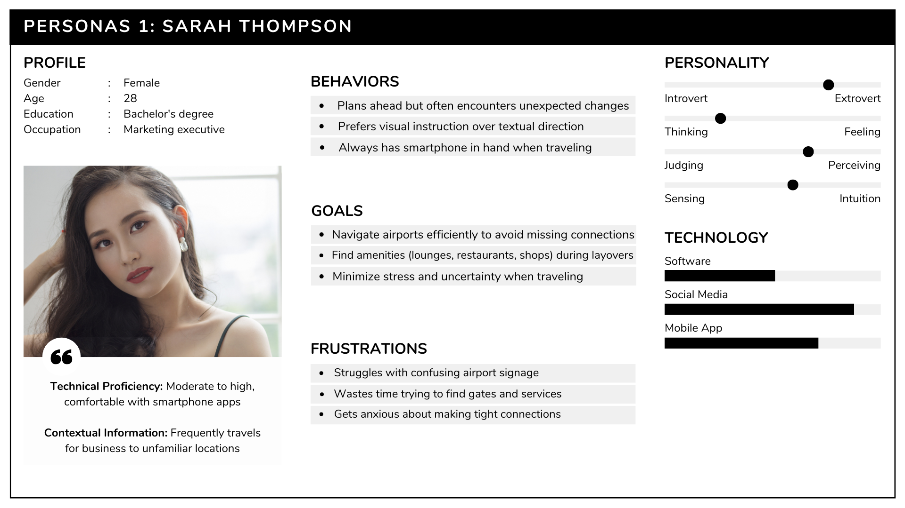
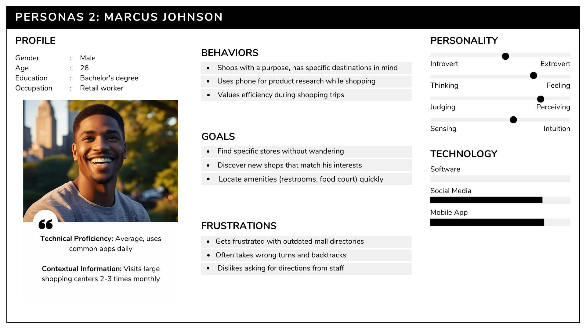
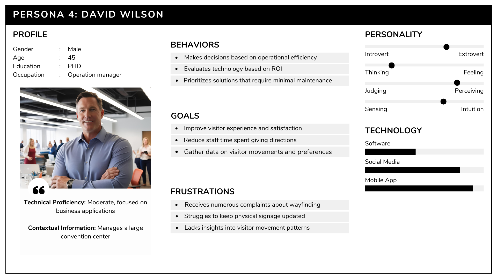
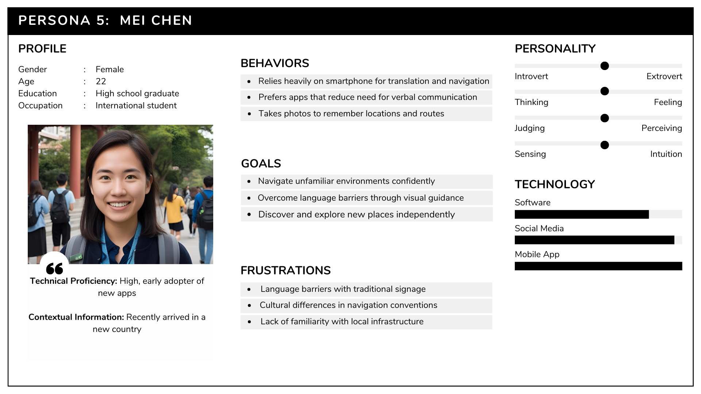

<p style="text-align:center">

# Functional Specification of LOC-INDOOR (Indoor Localisation)
</p>

<details>
<summary>Contents
<!-- TOC -->

## Table of content

<!-- TOC -->

</summary>
</details>

<p style="text-align:center">

## Line-Based Floor Navigation with AR Integration

- **Project Name**: Indoor Navigation System with AR Integration
- **Document Version**: 1.1
- **Last Updated**: March 14, 2025
- **Author**: Tsangue Vivien Bistrel
</p>

## 1. Introduction 

### 1.1 Purpose
This functional specification document outlines the detailed requirements and system design for an indoor navigation application that utilizes Augmented Reality (AR) and Bluetooth beacon technology. The system aims to solve the challenge of navigating complex indoor environments by providing intuitive, visual guidance through a mobile application.

### 1.2 Project Scope
The project encompasses the development of a mobile application for Android (with plans to expand to iOS) that provides real-time, line-based navigation guidance in indoor spaces where traditional GPS is ineffective. The system will utilize Bluetooth beacons for positioning and Augmented Reality to overlay directional guidance on the user's view of the physical environment.

### 1.3 Intended Audience
- Development team
- Project stakeholders
- Potential venue partners
- Investors and funding partners

## 2. Project Overview <a name="project-overview"></a>

### 2.1 Problem Statement
Users frequently struggle with navigation in complex indoor environments such as airports, shopping malls, 
hospitals and large public buildings. Traditional navigation solutions that rely on GPS are ineffective 
in these spaces.

### 2.2 Solution Description
The solution will implement a marker-based floor navigation system with AR 
overlays, inspired by racing video games like Forza Horizon. When users 
select a destination within a venue, the application will display a directional 
line on the floor through their device's camera view, guiding them seamlessly to 
their chosen location. Bluetooth beacons strategically placed throughout the venue 
will provide precise location data to ensure accurate navigation.

## 3. User Personas

### 3.1 Primary Personas

#### Persona 1: Traveler - Sarah Thompson


#### Persona 2: Mall Shopper - Marcus Johnson


#### Persona 3: Accessibility User - Elena Vasquez


#### Persona 4: Hospital Visitor - Robert Chen


### 3.2 Secondary Personas

#### Persona 5: Venue Administrator - David Wilson


#### Persona 6: First-time Visitor - Mei Chen


## 4. Use Cases 

### 4.1 Core Use Cases

#### UC-1: Airport Navigation
**Primary Actor:** Traveler (Sarah)
**Preconditions:**
- User has installed the application
- Airport has deployed beacon infrastructure
- User has granted necessary permissions

**Main Flow:**
1. User opens the application upon arriving at the airport
2. System detects user's location and displays available airport map
3. User searches for their departure gate number
4. System displays gate location on map
5. User selects "Navigate to Gate"
6. System activates AR view showing line on floor to follow
7. User follows the line, which adjusts in real-time as they move
8. System provides notifications for turns and level changes
9. System confirms arrival when user reaches the gate

**Postconditions:**
- User arrives at intended destination
- System logs successful navigation for analytics
- System prompts user for optional feedback

#### UC-2: Shopping Mall Navigation
**Primary Actor:** Mall Shopper (Marcus)
**Preconditions:**
- User has installed the application
- Mall has deployed beacon infrastructure
- Mall directory is updated in the system

**Main Flow:**
1. User enters the mall and opens the application
2. System detects location and displays mall layout
3. User searches for a specific store by name
4. System highlights store location on map
5. User selects "Navigate" option
6. System activates AR view with floor line
7. User follows the displayed path
8. System provides distance updates and directional guidance
9. User arrives at the store

**Postconditions:**
- User arrives at store.
- Navigation session is stored in history.

#### UC-3: Accessible Route Navigation
**Primary Actor:** Accessibility User (Elena)
**Preconditions:**
- User has installed application and set accessibility preferences
- Venue has accessible routes mapped in system
- Beacon infrastructure is installed

**Main Flow:**
1. User opens application in venue
2. System automatically applies accessibility profile
3. User searches for destination
4. System calculates route prioritizing accessible paths, elevators, and ramps
5. User initiates navigation
6. System displays AR guidance with additional accessibility information
7. User follows path optimized for mobility needs
8. System provides advance notice of elevators, ramps, and potential obstacles
9. User successfully navigates to destination

**Postconditions:**
- User arrives at destination via accessible route
- System logs route effectiveness for accessibility
- User can provide feedback on route accessibility

#### UC-4: Hospital Visitor Navigation
**Primary Actor:** Hospital Visitor (Robert Chen)
**Preconditions:**
- User has installed the application
- Hospital has deployed beacon infrastructure
- Visitor has basic patient room information

**Main Flow:**
1. Visitor arrives at hospital parking area and opens the application
2. System detects user's location and displays hospital overview
3. Visitor enters patient information (room number)
4. Visitor selects "Navigate to Patient Room"
5. System calculates optimal route from current location, including entry point selection
6. System activates AR view showing floor line to follow
7. System guides visitor through building entry, security checkpoints, and elevator/stair usage
8. Visitor follows the guided path with clear indicators for building transitions
9. System provides estimated arrival time and notifies visitor upon reaching the correct room

**Postconditions:**
- Visitor successfully locates patient room
- System creates a "frequent route" for easy access during future visits
- Navigation history allows quick return to previously visited locations


### 4.2 Additional Use Cases

#### UC-5: Multi-Destination Planning
**Primary Actor:** Mall Shopper (Marcus)
**Preconditions:**
- User has application installed
- User is in mapped venue
- User has multiple destinations to visit

**Main Flow:**
1. User opens application and selects "Plan Visit"
2. User adds multiple destinations to visit list
3. System suggests optimal order based on layout
4. User confirms or adjusts order
5. System generates route visiting all destinations efficiently
6. User initiates navigation to first destination
7. Upon arrival, system prompts to continue to next location
8. Navigation continues until all destinations are visited

**Postconditions:**
- User completes all planned destinations
- System logs complete journey
- User can save route for future visits


## 5. User Stories

### 5.1 Primary User Stories

1. **Airport Navigation**
    - As a traveler in an unfamiliar airport, I want to easily find my connecting gate so that I don't miss my flight.
    - As a passenger arriving at an airport, I want to find the nearest restroom, restaurant, or baggage claim area quickly.

2. **Shopping Mall Navigation**
    - As a shopper, I want to find specific stores or services within a large mall without checking physical directories.
    - As a mall visitor, I want to find the closest exit from my current location.

3. **Hospital/Healthcare Facility Navigation**
    - As a patient or visitor, I want to find specific departments or rooms within a hospital complex.

### 5.2 Secondary User Stories

1. **Special Needs Users**
    - As a user with mobility challenges, I want clear guidance that takes into account accessibility routes.

## 6. Functional Requirements 

### 6.1 Core Functional Requirements

#### FR-1: User Location Detection
- The system determine the user's precise indoor location using Bluetooth beacon technology.
- The system update the user's position in real-time (minimum refresh rate of 1 Hz).
- The system achieve positioning accuracy of at least 0.7 meters in areas with proper beacon coverage.

#### FR-2: Destination Selection
- Display a searchable directory of available destinations within the venue.
- Users can select destinations from categories (Restaurants, Stores, Services).
- The system support saving favorite or frequently visited destinations.

#### FR-3: AR Navigation Guidance
- The system displays a continuous directional line on the floor leading from the user's current position to their destination.
- Adjust the displayed path in real-time as the user moves.
- Provide visual cues for turns, elevators, escalators, and other navigation decision points.
- The system display distance to destination and estimated arrival time.

#### FR-4: Multi-floor Navigation
- The system shall guide users between different floors using appropriate vertical transportation (stairs, elevators, escalators).
- The system shall clearly indicate floor transitions in the AR guidance.
- The system shall automatically detect floor changes based on beacon data.

#### FR-5: Route Customization
- Offering route preferences (e.g., shortest path, accessible path).
- Allowing users to avoid specific areas or types of areas.

### 6.2 Additional Functional Requirements

#### FR-6: Offline Functionality
- The system shall download venue maps for offline use when possible.
- The system shall provide basic navigation functionality even when internet connectivity is limited.

#### FR-7: Venue Information
- The system shall display relevant information about destinations (operating hours, descriptions, etc.).
- The system shall provide notifications about nearby points of interest.

#### FR-8: User Profile and Settings
- The system shall allow users to create and manage profiles.
- The system shall support customization of navigation preferences.
- The system shall remember frequently visited locations.

#### FR-9: Accessibility Features
- The system shall provide voice guidance synchronized with visual guidance.
- The system shall support high-contrast modes for visibility.
- The system shall prioritize accessible routes for users who indicate mobility requirements.

## 7. Non-Functional Requirements

### 7.1 Usability Requirements

#### NFR-1: User Interface
- The user interface shall be intuitive and require minimal training for basic navigation tasks.
- The system shall be usable with one hand during navigation.
- Text elements shall adhere to minimum contrast ratios of 4.5:1 for normal text and 3:1 for large text.
- The application shall support portrait and landscape orientations.
- The AR view shall include clear visual cues that are distinguishable even in varied lighting conditions.

#### NFR-2: Accessibility
- The application shall be compatible with screen readers.
- All interactive elements shall be accessible via alternative input methods.
- The application shall comply with WCAG 2.1 AA standards where applicable.
- Cognitive load shall be minimized during navigation tasks.
- Text size shall be adjustable to accommodate users with visual impairments.

#### NFR-3: Learning Curve
- First-time users shall be able to successfully navigate to a destination with 90% success rate within 5 minutes of initial app use.
- The onboarding tutorial shall be completable in less than 2 minutes.
- Error messages shall be clear and provide actionable guidance.
- Help documentation shall be context-sensitive and accessible without leaving the current task.

### 7.2 Reliability Requirements

#### NFR-4: System Stability
- The application shall have a crash rate of less than 0.1% per navigation session.
- The system shall maintain functionality despite temporary loss of individual beacons.
- Recovery from loss of all beacon signals shall be graceful with clear user notifications.
- The application shall maintain state information to resume navigation after unexpected closure.

#### NFR-5: Availability
- The core navigation system shall be available 99.9% of the time when within beacon coverage.
- Beacon battery replacement shall be staggered to prevent simultaneous failure.
- System updates shall not disrupt active navigation sessions.

#### NFR-6: Fault Tolerance
- The system shall continue to function with degraded accuracy if up to 30% of beacons are non-functional.
- The system shall provide fallback navigation options (map view) if AR capabilities are unavailable.
- The system shall automatically recover from intermittent connectivity issues.

### 7.3 Performance Requirements

#### NFR-7: Response Time
- The application shall launch and be ready for navigation within at most 10 seconds on target devices.
- Route calculation shall complete within 3 seconds of destination selection.
- AR overlay shall render within 100ms of camera frame capture.
- Position updates shall be processed within 200ms of receiving beacon signals.
- UI interactions shall respond within 150ms to maintain perception of immediacy.

#### NFR-8: Resource Utilization
- The application shall use no more than 200MB of RAM during typical operation.
- Battery consumption shall not exceed 15% per hour of active navigation.
- Disk storage requirements shall not exceed 100MB excluding cached venue data.
- CPU utilization shall remain below 30% during normal operation.
- Network data usage shall not exceed 10MB per hour during active navigation.

#### NFR-9: Scalability
- The system architecture shall support up to 10,000 concurrent users per venue.
- The backend shall handle up to 100 venue deployments without significant performance degradation.
- Database design shall accommodate venues with up to 10,000 distinct navigation points.
- API endpoints shall scale to handle 1,000 requests per second during peak usage.

### 7.4 Supportability Requirements

#### NFR-10: Compatibility
- The mobile application shall support Android 10.0 and newer (initially).
- The mobile application shall support iOS 14.0 and newer (future release).
- The application shall function on devices with minimum specifications: 2GB RAM, Quad-core 2.0 GHz processor.
- The application shall adapt to different screen sizes from 4.7" to 12.9".
- The AR components shall be compatible with ARCore 1.20+ and ARKit 4.0+ (future release).

#### NFR-11: Localization
- The user interface shall support easy translation to multiple languages.
- Date, time, and measurement formats shall adapt to local conventions.
- The application shall initially support English, French.
- Text expansion in translations shall not break UI layouts.
- The system shall support right-to-left languages in future updates.

### 7.5 Security Requirements

#### NFR-13: Data Protection
- All personally identifiable information shall be encrypted using industry-standard encryption (minimum AES-256).
- Location history shall be stored on the device with optional cloud backup.
- Users shall have the ability to clear all personal data from the application.
- Compliance with GDPR, CCPA, and other relevant privacy regulations shall be maintained.

#### NFR-14: Authentication
- User accounts shall require strong password policies.
- The system shall support multi-factor authentication for administrative access.
- OAuth 2.0 integration shall be supported for social login options.

#### NFR-15: Security Testing
- The application shall undergo penetration testing before each major release.
- Automated security scanning shall be integrated into the CI/CD pipeline.
- Beacon infrastructure shall be secured against spoofing attacks.
- API endpoints shall be protected against common attacks (SQL injection, XSS, CSRF).
- Security vulnerabilities shall be addressed with critical priority.

## 8. System Architecture

### 8.1 High-Level Architecture
The system will follow a client-server architecture with the following components:

1. **Mobile Application (Client)**
    - AR Navigation Interface
    - Positioning System (Bluetooth Beacon Integration)
    - Map Rendering Engine
    - User Interface Components

2. **Backend Services (Server)**
    - User Management
    - Venue Data Management
    - Analytics Engine
    - API Gateway

3. **Infrastructure Components**
    - Bluetooth Beacons Network
    - Cloud Storage
    - Content Delivery Network
    - Database Systems

### 8.2 Architectural Diagram

```
+----------------------------------+        +----------------------------------+
|       Mobile Application         |        |        Backend Services          |
|                                  |        |                                  |
|  +------------+  +------------+  |        |  +------------+  +------------+  |
|  |    AR      |  | Bluetooth  |  |        |  |   User     |  |   Venue    |  |
|  | Navigation |  | Positioning|  |        |  | Management |  |    Data    |  |
|  +------------+  +------------+  |        |  +------------+  +------------+  |
|                                  |        |                                  |
|  +------------+  +------------+  |        |  +------------+  +------------+  |
|  |    Map     |  |    UI      |  |<------>|  | Analytics  |  |    API     |  |
|  |  Renderer  |  | Components |  |        |  |   Engine   |  |   Gateway  |  |
|  +------------+  +------------+  |        |  +------------+  +------------+  |
+----------------------------------+        +----------------------------------+
                 ^                                            ^
                 |                                            |
                 v                                            v
+----------------------------------+        +----------------------------------+
|   Infrastructure Components      |        |        External Services         |
|                                  |        |                                  |
|  +------------+  +------------+  |        |    +------------+                |
|  | Bluetooth  |  |   Cloud    |  |        |    |   Social   |                |
|  |  Beacons   |  |  Storage   |  |        |    |   Media    |                |
|  +------------+  +------------+  |        |    +------------+                |
|                                  |        |                                  |
|  +------------+  +------------+  |        |  +------------+  +------------+  |
|  |   CDN      |  | Database   |  |        |  | Third-party|  | Feedback   |  |
|  |            |  |  Systems   |  |        |  |    Maps    |  |  Systems   |  |
|  +------------+  +------------+  |        |  +------------+  +------------+  |
+----------------------------------+        +----------------------------------+
```

## 9. Technical Components

### 9.1 Mobile Application Components

#### 9.1.1 AR Development Platform
- **Unity AR Foundation**
    - Purpose: Provides a unified interface for building AR applications for both Android and iOS
    - Key Features:
        - Camera access and management
        - Motion tracking
        - Environmental understanding
        - Light estimation
        - Image recognition

#### 9.1.2 Line-Based AR Library
- **Vectrosity**
    - Purpose: Enables the drawing of vector graphics in Unity
    - Key Features:
        - High-performance line rendering
        - Dynamic path updates
        - Customizable line appearance
        - Optimization for mobile devices

#### 9.1.3 Bluetooth Beacon Integration
- **Beacon SDK**
    - Purpose: Detects and interacts with Bluetooth beacons
    - Supported SDK Protocols:
        - iBeacon for iOS
        - Eddystone for Android
        - AltBeacon for both iOS/Android
    - Key Features:
        - Background scanning
        - Distance estimation
        - Signal strength filtering
        - Region monitoring

#### 9.1.4 Positioning Algorithm
- **Trilateration Engine**
    - Purpose: Calculates precise position based on beacon signals
    - Key Features:
        - Signal strength to distance conversion
        - Multi-beacon triangulation
        - Position smoothing (Kalman filtering)
        - Floor detection

#### 9.1.5 Map Rendering
- **2D/3D Map Engine**
    - Purpose: Displays venue maps and integrates with AR components
    - Key Features:
        - Multi-floor visualization
        - POI (Point of Interest) rendering
        - Dynamic path calculation
        - Map rotation based on device orientation

### 9.2 Backend Components

#### 9.2.1 User Management Service
- **Authentication System**
    - User registration and login
    - Profile management
    - Session management

#### 9.2.2 Venue Data Management
- **CMS for Venue Information**
    - Floor plan management
    - POI management
    - Beacon configuration
    - Path network definition

#### 9.2.3 API Gateway
- **RESTful API Services**
    - Authentication endpoints

### 9.3 Infrastructure Components

- [Bluetooth Beacon Specification](MBM01%20Ultra-Long%20Range%20Beacon.pdf)


## 10. User Interface Design

### 10.1 Core Screens

#### 10.1.1 Onboarding Screens
- Introduction to the application
- Permission requests (camera, location)
- Basic tutorial on using AR navigation

#### 10.1.2 Venue Selection Screen
- List of available venues
- Search functionality
- Recently visited venues
- Venue information preview

#### 10.1.3 Destination Selection Screen
- Searchable directory
- Category-based browsing
- Favorites and recents
- Destination details

#### 10.1.4 AR Navigation View
- Camera view with AR overlay
- Directional line on floor
- Distance and ETA indicators
- Navigation controls (pause, restart, end)
- Floor indicators for multi-floor navigation

#### 10.1.5 Map View
- 2D floor plan view
- Current location indicator
- Planned route
- POI indicators
- Floor selector for multi-floor venues

### 10.2 UI Components

#### 10.2.1 Navigation Controls
- Start/stop navigation button
- Reroute button
- Camera zoom controls
- AR mode toggle (AR view vs. map view)

#### 10.2.2 Information Displays
- Distance remaining
- Estimated time to arrival
- Current floor indicator
- Next direction indicator
- Nearby POIs

#### 10.2.3 Search and Filter Components
- Search bar with autocomplete
- Category filters
- Accessibility filters
- Sorting options (distance, popularity)

### 10.3 UI Flow Diagrams

#### 10.3.1 Main Navigation Flow

```
App Launch → Venue Selection → Destination Selection → 
AR Navigation Setup → Active Navigation → Destination Arrival
```

#### 10.3.2 Multi-destination Flow

```
Active Navigation → Add Additional Destination → 
Optimize Route → Continue Navigation → Destination 1 Arrival → 
Navigation to Destination 2 → Destination 2 Arrival
```

## 11. Data Flow <a name="data-flow"></a>

### 11.1 User Location Data Flow

1. Bluetooth beacons broadcast identifier and signal strength
2. Mobile application detects beacon signals
3. Positioning algorithm calculates user position based on multiple beacon signals
4. Position data is processed through smoothing algorithms
5. AR components use position data to render guidance
6. User movement updates trigger recalculation of position and guidance

### 11.2 Navigation Data Flow

1. User selects destination
2. Application requests optimal route from backend
3. Backend calculates route based on current position and destination
4. Route data is sent to mobile application
5. AR components render route as floor line
6. Position updates trigger route rendering updates
7. Navigation completes when user reaches destination

### 11.3 Venue Data Flow

1. Venue administrators create and update venue data (maps, POIs, etc.)
2. Data is stored in backend databases
3. Mobile application requests venue data on demand
4. Venue data is cached locally for offline use
5. Updates to venue data trigger synchronization when online

## 12. Integration Requirements <a name="integration-requirements"></a>

### 12.1 Beacon Integration

#### 12.1.1 Beacon Communication Protocol
- Bluetooth Low Energy (BLE) 4.0 or higher
- Support for iBeacon, Eddystone, and AltBeacon formats
- Secure broadcast with rotating identifiers

#### 12.1.2 Beacon Management System
- Beacon registration and configuration
- Battery status monitoring
- Signal strength calibration
- Maintenance scheduling

### 12.2 Map Integration

#### 12.2.1 Floor Plan Format Requirements
- Vector-based format (SVG preferred)
- Layer structure for different floor elements
- Coordinate system alignment with physical space
- POI annotation support

#### 12.2.2 Path Network Requirements
- Node-edge graph structure
- Weighted edges for distance calculation
- Attribute support for accessibility information
- Connection points between floors

### 12.3 External System Integration

#### 12.3.1 Venue Management Systems
- API integration with existing venue CMS
- Data synchronization protocols
- Event notification system

#### 12.3.2 Analytics Integration
- User journey tracking
- Heatmap generation
- Traffic pattern analysis
- Performance metrics reporting

## 13. Performance Requirements <a name="performance-requirements"></a>

### 13.1 Positioning Accuracy
- Horizontal accuracy: ±2 meters in areas with proper beacon coverage
- Floor detection accuracy: 99% in areas with proper beacon coverage
- Position update rate: minimum 1 Hz, target 5 Hz

### 13.2 Response Time
- Initial route calculation: <2 seconds
- Route update after position change: <500ms
- AR rendering latency: <100ms
- UI responsiveness: <200ms for user interactions

### 13.3 Resource Utilization
- Memory usage: <200MB during active navigation
- CPU usage: <30% of device capability
- Battery impact: <15% per hour of active navigation
- Data usage: <10MB for initial venue download, <1MB per hour during navigation

### 13.4 Scalability
- Support for venues up to 500,000 square meters
- Support for up to 5,000 POIs per venue
- Support for up to 2,000 beacons per venue
- Concurrent users: up to 10,000 per venue

## 14. Security Considerations <a name="security-considerations"></a>

### 14.1 Data Security
- End-to-end encryption for all network communications
- Secure storage of user credentials and preferences
- Anonymous tracking of navigation data
- Compliance with GDPR and other relevant privacy regulations

### 14.2 Beacon Security
- Prevention of beacon spoofing
- Rotating beacon identifiers
- Secure beacon deployment and registration
- Access control for beacon management

### 14.3 Application Security
- Secure API authentication
- Input validation and sanitization
- Protection against common mobile vulnerabilities


## Glossary - Indoor Navigation System with AR Integration

### A

**AR (Augmented Reality):** Technology that overlays digital information onto the real world viewed through a device's camera, used in this system to display directional lines on the floor.

**AltBeacon:** An open-source Bluetooth Low Energy beacon protocol alternative to proprietary protocols.

**Accessibility Route:** A navigation path that prioritizes elevator access, ramps, and avoids stairs for users with mobility impairments.

### B

**Beacon:** A small Bluetooth Low Energy (BLE) transmitter that broadcasts signals used to determine a user's position within an indoor environment.

**BLE (Bluetooth Low Energy):** A wireless personal area network technology designed for applications in healthcare, fitness, beacons, security, and home entertainment industries that require devices to exchange small amounts of data periodically while maintaining long battery life.

### C

**CMS (Content Management System):** Software used to manage the creation and modification of venue information, floor plans, and points of interest.

### E

**Eddystone:** An open beacon protocol from Google that defines several different frame types that can be used individually or in combinations to create beacons that address a variety of different use cases.

### F

**Floor Plan:** A scaled diagram of a venue showing walls, doors, and other physical features from an overhead view, used as the base map for the navigation system.

### H

**Heatmap:** A graphical representation of data where values are represented as colors, used in this system to visualize user traffic patterns within venues.

### I

**iBeacon:** Apple's protocol for Bluetooth Low Energy (BLE) proximity sensing that enables smartphones, tablets and other devices to perform actions when in close proximity to an iBeacon.

**Indoor Positioning System (IPS):** A network of devices used to locate people or objects where GPS is inadequate, such as inside buildings.

### K

**Kalman Filtering:** A mathematical algorithm used to reduce noise and smooth position data from multiple beacon signals.

### L

**Line-Based Navigation:** The system's core feature that displays a continuous directional line on the floor through AR, guiding users to their destination.

### M

- **Multi-floor Navigation:** The ability of the system to guide users between different floors of a building using appropriate vertical transportation methods.
- **MBBS:** (Bachelor of Medicine, Bachelor of Surgery) is professional degree awarded in some countries, equivalent to the MD degree

### N

**Node-Edge Graph:** A mathematical structure used to model the network of possible paths in a venue, where nodes represent intersections or points of interest and edges represent walkable paths.

### P

- **POI (Point of Interest):** A specific location within a venue that may be a destination or landmark, such as a store, restaurant, restroom, or information desk.

- **Positioning Algorithm:** The software process that calculates a user's exact location based on signals received from multiple beacons.

### R

- **Route Calculation:** The process of determining the optimal path between a user's current location and their desired destination.
- **ROI:** Return Of Investment.

### S

**Signal Strength:** The measure of power present in a beacon's radio signal, used to estimate distance from the beacon to the user's device.

**SVG (Scalable Vector Graphics):** An XML-based vector image format used for floor plans that allows for high-quality scaling without loss of detail.

### T

**Trilateration:** A method to determine position by measuring distances to multiple beacons at known locations.

### U

**UI (User Interface):** The means by which users interact with the application, including screens, buttons, and visual elements.

**UX (User Experience):** The overall experience of a person using the application, especially in terms of how easy or pleasing it is to use.

### V

**Venue:** A physical location where the navigation system is implemented, such as an airport, shopping mall, hospital, or convention center.

**Vertical Transportation:** Methods of moving between floors in a building, including elevators, escalators, and stairs, which are accounted for in the navigation system.

### W

**Wayfinding:** The process of determining and following a route between an origin and a destination, which this system aims to simplify through AR guidance.

**WCAG (Web Content Accessibility Guidelines):** A set of recommendations for making content accessible to people with disabilities, which the system adheres to for its user interface.