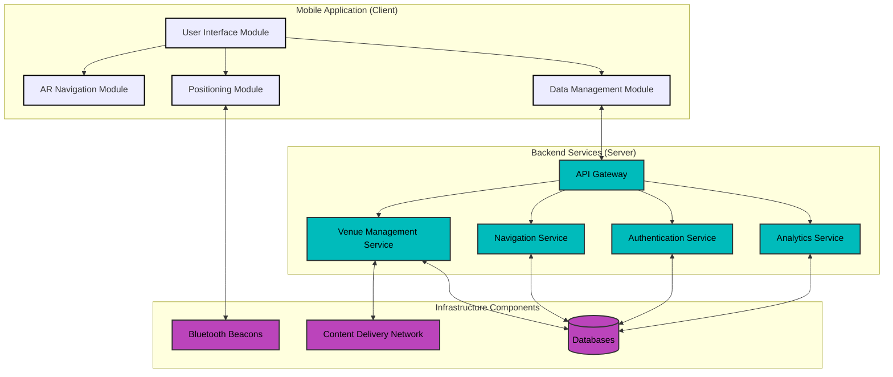
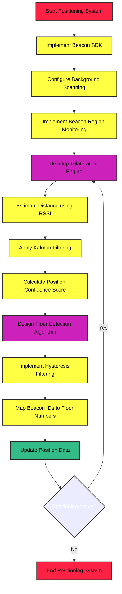
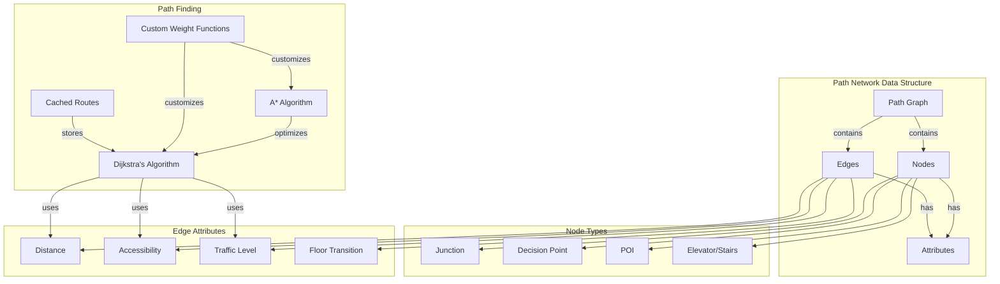

<div align="center">

# Technical Specification of LOC-INDOOR (Indoor Localisation)
</div>

<details>
<summary>Contents</summary>
<!-- TOC -->

## Table of content

<!-- TOC -->


</details>

<div align="center">


## Line-Based Floor Navigation with AR Integration

**Project Name**: Indoor Navigation System with AR Integration

**Document Version**: 1.1

**Last Updated**: March 14, 2025

**Author**: Tsangue Vivien Bistrel
</div>


# Technical Specification Document: LOC-INDOOR (Indoor Localisation)

## 1. Introduction

This document defines the technical specifications for the LOC-INDOOR indoor navigation system, which leverages Augmented Reality (AR) and Bluetooth beacon technology to provide real-time indoor navigation assistance. It serves as a reference for the development process, outlining architecture, data flow, APIs, security considerations, and deployment strategies.

### 1.1 System Overview
LOC-INDOOR is an indoor navigation application that uses Augmented Reality (AR) and Bluetooth beacon technology to solve the challenge of navigating complex indoor environments. The system provides intuitive, line-based visual guidance through a mobile application, similar to racing game waypoint systems. When users select a destination, the application displays a directional line on the floor through their device's camera view, guiding them to their chosen location.

### 1.2 Development Scope
This technical specification covers:

- Mobile application development (initially for Android, with iOS planned)
- Backend system implementation
- Bluetooth beacon integration
- AR component development
- Location tracking algorithms
- User interface implementation
- Data management and security protocols

## 2. System Architecture Implementation

### 2.1 Client-Server Architecture Overview

The system will implement a client-server architecture with three main components:

1. **Mobile Application (Client):** 
   - Developed with Unity and integrated with AR Foundation
   - Language: C# (Unity scripts)
   - Vector Graphics: Vectrosity plugin for line rendering
   - Bluetooth: Native Android Bluetooth APIs with platform-specific plugins
2. **Backend Services (Server):** 
   - RESTful API for authentication, venue data, and general requests, services built on a cloud platform
   - WebSockets for real-time navigation updates.
   - Framework: Node.js with Express
   - Database: MongoDB (venue data) and PostgreSQL (user data)
   - Authentication: JWT-based token system
   - Hosting: AWS infrastructure
3. **Infrastructure Components:** 
   - Physical Bluetooth beacons deployed within venues
   - Data Storage: AWS S3 for venue maps and assets
   - CDN: AWS CloudFront for static content delivery
   - CI/CD: GitHub Actions with automated testing

### 2.2 Architectural Implementation Flow

The implementation will follow a layered approach:

1. **Data Layer** - Database design, ORM mapping, and data access patterns
2. **Service Layer** - Business logic, positioning algorithms, and route calculations
3. **API Layer** - RESTful endpoints for client-server communication
4. **Presentation Layer** - Mobile application UI/UX and AR components



### 2.3 Required Components and Technologies
The different technologies with their roles and responsibilities in the LOC-INDOOR project:


- **Unity and C#**: Mobile application development with AR capabilities.
- **Node.js and Express**: Backend services for handling requests and APIs.
- **MongoDB and PostgreSQL**: Data storage for venues and users.
- **Bluetooth Beacons**: Indoor positioning.
- **AWS S3 and CloudFront**: Storage and delivery of static content.
- **GitHub Actions**: Automated CI/CD pipelines.
- **RESTful API and WebSockets**: Communication and real-time updates.
- **JWT and AWS Infrastructure**: Security and scalability.

Each technology plays a crucial role in ensuring the LOC-INDOOR project is robust, scalable, and provides a seamless user experience.

## 3. Mobile Application Implementation

### 3.1 Development Environment Setup

1. Install Unity 2023.1 or later with AR Foundation package
2. Configure Android SDK (minimum API level 29)
3. Set up version control with Git, including branching strategy
4. Implement CI/CD pipeline using GitHub Actions or similar service

### 3.2 AR Navigation Implementation

1. **Camera Integration**
   - Utilize AR Foundation's ARCameraManager to access device camera
   - Implement camera permission handling with graceful fallbacks
   - Configure camera settings for optimal performance in varied lighting conditions

```Pseudo-Code
   // Camera Integration
   
   FUNCTION initializeCamera()
      IF ARFoundation.ARCameraManager is available THEN
         REQUEST camera permission
         IF permission granted THEN
            CONFIGURE camera settings for optimal performance
            SET camera mode to AR
         ELSE
            DISPLAY permission error message
            PROVIDE fallback options
         ENDIF
      ELSE
         DISPLAY AR not supported message
      ENDIF
   END FUNCTION
```

2. **Line-Based Navigation Rendering**
   - Implement the Vectrosity library to draw vector lines in 3D space
   - Create a LineRenderer component that dynamically updates based on positioning data
   - Apply proper depth testing to ensure lines appear on the floor
   - Implement color gradients to indicate distance.
   - Add an animated element to indicate the destination point.

```Pseudo-Code
   //  Line-Based Navigation Rendering
   
   FUNCTION renderNavigationLine(positionData)
       INITIALIZE Vectrosity LineRenderer
       SET LineRenderer start position to current user position
       SET LineRenderer end position based on positionData
       APPLY depth testing to ensure lines appear on the floor
       SET color gradient based on distance
       ADD animated element at destination point
       UPDATE LineRenderer dynamically as positionData changes
   END FUNCTION

```

3. **Path Visualization**
   - Design path segments with distinct visual cues for different actions (straight, turn, elevator, etc.)
   - Create animated chevrons to indicate direction of travel
   - Implement distance markers at regular intervals along the path
   - Design clear visual indicators for decision points

```Pseudo-Code
   // Path Visualization
   FUNCTION visualizePath(pathSegments)
       FOR EACH segment IN pathSegments DO
           IF segment type is 'straight' THEN
               DRAW straight line segment
           ELSEIF segment type is 'turn' THEN
               DRAW curved line segment with turn indicator
           ELSEIF segment type is 'elevator' THEN
               DRAW elevator icon with direction arrow
           ENDIF
           ADD distance markers at regular intervals
           ADD animated chevrons or arrows for direction
           ADD visual indicators for decision points
       END FOR
   END FUNCTION

```

````mermaid
flowchart TD
   A[Start AR Navigation] --> B{ARCameraManager Available?}
   B -- Yes --> C[Request Camera Permission]
   B -- No --> D[Display AR Not Supported Message]
   C --> E{Permission Granted?}
   E -- Yes --> F[Configure Camera for AR]
   E -- No --> G[Display Permission Error]
   F --> H[Initialize Vectrosity LineRenderer]
   H --> I[Set LineRenderer Positions]
   I --> J[Apply Depth Testing]
   J --> K[Set Color Gradient]
   K --> L[Add Animated Destination Element]
   L --> M[Update LineRenderer Dynamically]
   M --> N[Get Path Segments from Backend]
   N --> O[Visualize Path]
   O --> P{Segment Type}
   P -- Straight --> Q[Draw Straight Line]
   P -- Turn --> R[Draw Curved Line with Turn Indicator]
   P -- Elevator --> S[Draw Elevator Icon]
   Q --> T[Add Distance Markers]
   R --> T
   S --> T
   T --> U[Add Animated Chevrons]
   U --> V[Add Decision Point Indicators]
   V --> W[Update UI with Navigation Info]
   W --> X{Navigation Active?}
   X -- Yes --> M
   X -- No --> Y[End AR Navigation]
   G --> Y
   D --> Y
````

### 3.3 Positioning System Implementation

1. **Beacon SDK Integration**
   - Implement the selected Beacon SDK (supporting AltBeacon)
   - Configure background scanning parameters to balance accuracy and battery life
   - Implement beacon region monitoring for seamless transitions

2. **Trilateration Engine**
   - Develop a positioning algorithm using signal strength from multiple beacons
   - Implement distance estimation based on RSSI (Received Signal Strength Indicator)
   - Apply Kalman filtering to smooth position data and reduce "jitter"
   - Create a position confidence score based on number and quality of beacon signals

3. **Floor Detection**
   - Design a floor transition detection algorithm using beacon identifiers
   - Implement hysteresis filtering to prevent false floor change detections
   - Create a mapping system between beacon IDs and floor numbers



### 3.4 Map Rendering Implementation

1. **Vector Map Rendering**
   - Develop a 2D map renderer that supports SVG-based floor plans
   - Implement efficient rendering for large and complex maps
   - Create a coordinate system transformation between physical and map coordinates
   - Support multi-floor visualization with floor selection UI

2. **Path Network Implementation**
   - Create a graph-based data structure for path networks
   - Implement Dijkstra's algorithm for path finding with customizable weights
   - Support path customization based on user preferences (shortest, accessible, etc.)
   - Design a caching system for common routes to improve performance



## 4. Backend Services Implementation

### 4.1 User Management Service

1. **Authentication System**
   - Implement OAuth 2.0 with support for social logins
   - Create secure password storage using bcrypt with appropriate salt
   - Develop JWT (JSON Web Token) implementation for session management
   - Design API endpoints for user registration, login, and password reset

2. **Profile Management**
   - Create database schema for user profiles
   - Implement CRUD operations for profile management
   - Design data access patterns optimized for read operations

### 4.2 Venue Data Management

1. **CMS(Content Management System) Implementation**
   - Create import/export functionality for floor plans (supporting SVG format)
   - Implement POI management with categorization and search capabilities
   - Design beacon configuration interface with validation rules

2. **Data Synchronization**
   - Create a differential update system to minimize data transfer
   - Implement version control for venue data to support rollbacks
   - Develop a notification system for client applications when updates are available
   - Design a caching strategy for venue data

```mermaid
   flowchart TD
   A[Start Backend Services] --> B[User Management Service]
   A --> C[Venue Data Management]
   style A fill:#f24,stroke:#333,stroke-width:2px,color:#000;
   style B fill:#cc,stroke:#333,stroke-width:2px
   style C fill:#cc,stroke:#333,stroke-width:2px

%% User Management Service %%
   B --> D[Authentication System]
   D --> E[Implement OAuth 2.0]
   D --> F[Secure Password Storage]
   D --> G[JWT Session Management]
   D --> H[API Endpoints]
   style D fill:#c2b,stroke:#333,stroke-width:2px,color:#000;
   style E fill:#ff4,stroke:#333,stroke-width:2px,color:#000;
   style F fill:#ff4,stroke:#333,stroke-width:2px,color:#000;
   style G fill:#ff4,stroke:#333,stroke-width:2px,color:#000;
   style H fill:#ff4,stroke:#333,stroke-width:2px,color:#000;

   E --> E1[Support Social Logins]
   F --> F1[Use bcrypt with Salt]
   G --> G1[Generate JWT for Sessions]
   H --> H1[User Registration]
   H --> H2[Login]
   H --> H3[Password Reset]
   style E1 fill:#3b8,stroke:#333,stroke-width:2px,color:#000;
   style F1 fill:#3b8,stroke:#333,stroke-width:2px,color:#000;
   style G1 fill:#3b8,stroke:#333,stroke-width:2px,color:#000;
   style H1 fill:#3b8,stroke:#333,stroke-width:2px,color:#000;
   style H2 fill:#3b8,stroke:#333,stroke-width:2px,color:#000;
   style H3 fill:#3b8,stroke:#333,stroke-width:2px,color:#000;

   B --> I[Profile Management]
   I --> J[Database Schema]
   I --> K[CRUD Operations]
   I --> L[Optimize Data Access]
   style I fill:#c2b,stroke:#333,stroke-width:2px,color:#000;
   style J fill:#ff4,stroke:#333,stroke-width:2px,color:#000;
   style K fill:#ff4,stroke:#333,stroke-width:2px,color:#000;
   style L fill:#ff4,stroke:#333,stroke-width:2px,color:#000;

   J --> J1[User Profiles]
   K --> K1[Create, Read, Update, Delete]
   L --> L1[Optimize for Read Operations]
   style J1 fill:#3b8,stroke:#333,stroke-width:2px,color:#000;
   style K1 fill:#3b8,stroke:#333,stroke-width:2px,color:#000;
   style L1 fill:#3b8,stroke:#333,stroke-width:2px,color:#000;

%% Venue Data Management %%
   C --> M[CMS Implementation]
   M --> N[Admin Interface]
   M --> O[Import/Export Functionality]
   M --> P[POI Management]
   M --> Q[Beacon Configuration]
   style M fill:#c2b,stroke:#333,stroke-width:2px,color:#000;
   style N fill:#ff4,stroke:#333,stroke-width:2px,color:#000;
   style O fill:#ff4,stroke:#333,stroke-width:2px,color:#000;
   style P fill:#ff4,stroke:#333,stroke-width:2px,color:#000;
   style Q fill:#ff4,stroke:#333,stroke-width:2px,color:#000;

   N --> N1[Venue Management]
   O --> O1[Support SVG Format]
   P --> P1[Categorization and Search]
   Q --> Q1[Validation Rules]
   style N1 fill:#3b8,stroke:#333,stroke-width:2px,color:#000;
   style O1 fill:#3b8,stroke:#333,stroke-width:2px,color:#000;
   style P1 fill:#3b8,stroke:#333,stroke-width:2px,color:#000;
   style Q1 fill:#3b8,stroke:#333,stroke-width:2px,color:#000;

   C --> R[Data Synchronization]
   R --> S[Differential Update System]
   R --> T[Version Control]
   R --> U[Notification System]
   R --> V[Caching Strategy]
   style R fill:#c2b,stroke:#333,stroke-width:2px,color:#000;
   style S fill:#ff4,stroke:#333,stroke-width:2px,color:#000;
   style T fill:#ff4,stroke:#333,stroke-width:2px,color:#000;
   style U fill:#ff4,stroke:#333,stroke-width:2px,color:#000;
   style V fill:#ff4,stroke:#333,stroke-width:2px,color:#000;

   S --> S1[Minimize Data Transfer]
   T --> T1[Support Rollbacks]
   U --> U1[Notify Client Applications]
   V --> V1[Cache Venue Data]
   style S1 fill:#3b8,stroke:#333,stroke-width:2px,color:#000;
   style T1 fill:#3b8,stroke:#333,stroke-width:2px,color:#000;
   style U1 fill:#3b8,stroke:#333,stroke-width:2px,color:#000;
   style V1 fill:#3b8,stroke:#333,stroke-width:2px,color:#000;

```




## 5. Infrastructure Components Implementation

### 5.1 Bluetooth Beacon Deployment

1. **Beacon Selection**
    - Use the [MBM01 Ultra-Long Range Beacon](../FunctionalSpecification/MBM01%20Ultra-Long%20Range%20Beacon.pdf)
    - Ensure compatibility with both AltBeacon protocols
    - Verify firmware update capabilities
    - Test signal consistency in various environmental conditions

2. **Deployment Strategy**
    - Calculate optimal beacon placement using coverage modeling
    - Target placement density of 1 beacon per 100-150 square meters
    - Prioritize placement near decision points (intersections, elevators)
    - Develop a beacon testing and validation process

3. **Beacon Management**
    - Create a unique identification scheme for beacons (including floor information)
    - Develop a beacon firmware update process

### 5.2 Cloud Infrastructure Implementation

1. **Database Design**
    - Implement PostgreSQL for relational data (user profiles, analytics)
    - Utilize MongoDB for venue data (maps, POIs, path networks)
    - Create appropriate indexing strategy for query optimization

2. **API Gateway**
    - Develop RESTful API with OpenAPI specification
    - Implement rate limiting and request throttling
    - Create comprehensive API documentation
    - Design API versioning strategy

3. **Content Delivery Network**
    - Configure CDN for static assets (map tiles, images)
    - Implement regional edge caching for faster asset delivery
    - Design cache invalidation strategy for updated content
    - Create fallback mechanisms for CDN failures

## 6. Positioning Algorithm Implementation
     
### 6.1 Trilateration Algorithm

1. **Signal Processing**
    - Implement RSSI(Received Signal Strength Indicator) to distance conversion using environmental calibration 
    - Create signal strength filtering to remove outliers
    - Develop signal smoothing using exponential moving average
    - Design adaptive signal processing based on movement patterns

2. **Position Calculation**
    - Implement weighted trilateration using 3+ beacons
    - Create confidence scoring based on beacon geometry and signal quality
    - Implement dead reckoning for areas with limited beacon coverage

3. **Kalman Filter Implementation**
    - Design a state transition model for user movement
    - Implement measurement update using beacon signals for position correction
    - Create adaptive noise parameters based on signal quality to improve accuracy
    - Develop a convergence detection algorithm for stable positioning 

### 6.2 Path Finding Implementation

1. **Graph Construction**
    - Create a directed weighted graph representation of walkable paths
    - Implement node attributes for special locations (elevators, stairs)
    - Develop a graph serialization format for efficient storage and transmission

2. **Routing Algorithm**
    - Implement Dijkstra's algorithm for shortest path calculation
    - Develop A* algorithm implementation for improved performance
    - Design route caching strategy for common destinations

3. **Multi-floor Pathfinding**
    - Implement vertical connection nodes for floor transitions
    - Create special handling for elevators and escalators
    - Design path visualization for floor changes
    - Develop floor transition detection and guidance

```mermaid
flowchart TD
   A[Start Path Finding] --> B[Graph Construction]
   style A fill:#f9f,stroke:#333,stroke-width:2px,color:#000;
   style B fill:#cfc,stroke:#333,stroke-width:2px,color:#000;

%% Graph Construction %%
   B --> C[Create Directed Weighted Graph]
   B --> D[Implement Node Attributes]
   B --> E[Design Edge Attributes]
   B --> F[Develop Graph Serialization]
   style C fill:#ff9,stroke:#333,stroke-width:2px,color:#000;
   style D fill:#ff9,stroke:#333,stroke-width:2px,color:#000;
   style E fill:#ff9,stroke:#333,stroke-width:2px,color:#000;
   style F fill:#ff9,stroke:#333,stroke-width:2px,color:#000;

   C --> C1[Walkable Paths]
   D --> D1[Special Locations]
   E --> E1[Path Properties]
   F --> F1[Efficient Storage]
   style C1 fill:#9f9,stroke:#333,stroke-width:2px,color:#000;
   style D1 fill:#9f9,stroke:#333,stroke-width:2px,color:#000;
   style E1 fill:#9f9,stroke:#333,stroke-width:2px,color:#000;
   style F1 fill:#9f9,stroke:#333,stroke-width:2px,color:#000;

%% Routing Algorithm %%
   B --> G[Routing Algorithm]
   style G fill:#bbf,stroke:#333,stroke-width:2px,color:#000;

   G --> H[Implement Dijkstra's Algorithm]
   G --> I[Create Custom Cost Functions]
   G --> J[Develop A* Algorithm]
   G --> K[Design Route Caching]
   style H fill:#ff9,stroke:#333,stroke-width:2px,color:#000;
   style I fill:#ff9,stroke:#333,stroke-width:2px,color:#000;
   style J fill:#ff9,stroke:#333,stroke-width:2px,color:#000;
   style K fill:#ff9,stroke:#333,stroke-width:2px,color:#000;

   H --> H1[Shortest Path Calculation]
   I --> I1[User Preferences]
   J --> J1[Improved Performance]
   K --> K1[Common Destinations]
   style H1 fill:#9f9,stroke:#333,stroke-width:2px,color:#000;
   style I1 fill:#9f9,stroke:#333,stroke-width:2px,color:#000;
   style J1 fill:#9f9,stroke:#333,stroke-width:2px,color:#000;
   style K1 fill:#9f9,stroke:#333,stroke-width:2px,color:#000;

%% Multi-floor Pathfinding %%
   B --> L[Multi-floor Pathfinding]
   style L fill:#bbf,stroke:#333,stroke-width:2px,color:#000;

   L --> M[Vertical Connection Nodes]
   L --> N[Special Handling for Elevators]
   L --> O[Path Visualization]
   L --> P[Floor Transition Detection]
   style M fill:#ff9,stroke:#333,stroke-width:2px,color:#000;
   style N fill:#ff9,stroke:#333,stroke-width:2px,color:#000;
   style O fill:#ff9,stroke:#333,stroke-width:2px,color:#000;
   style P fill:#ff9,stroke:#333,stroke-width:2px,color:#000;

   M --> M1[Floor Transitions]
   N --> N1[Elevators and Escalators]
   O --> O1[Floor Changes]
   P --> P1[Real-time Guidance]
   style M1 fill:#9f9,stroke:#333,stroke-width:2px,color:#000;
   style N1 fill:#9f9,stroke:#333,stroke-width:2px,color:#000;
   style O1 fill:#9f9,stroke:#333,stroke-width:2px,color:#000;
   style P1 fill:#9f9,stroke:#333,stroke-width:2px,color:#000;

```



## 7. User Interface Implementation

### 7.1 Onboarding Flow

1. **First Launch Experience**
    - Design progressive permission requests with clear explanations
    - Create interactive tutorial explaining AR navigation concepts
    - Implement account creation and login screens

2. **Venue Selection**
    - Implement nearby venue detection
    - Create venue search functionality with filters
    - Implement venue favorites and recent visits

### 7.2 Destination Selection

1. **Search Implementation**
    - Create search index for POIs with autocomplete 
    - Implement fuzzy matching for search terms
    - Design category-based browsing interface
    - Develop recent and favorite destinations display

2. **Map Interaction**
    - Implement tap-to-select POI functionality
    - Create map panning and zooming with gesture control
    - Design multi-floor selection interface
    - Develop POI details display with actionable information

### 7.3 AR Navigation View

1. **Camera View Integration**
    - Implement camera preview with proper aspect ratio handling
    - Create camera permission handling with fallback options
    - Design orientation changes handling.

2. **Navigation Overlay**
    - Implement line rendering on the floor with proper perspective
    - Create distance and ETA(Estimated Time of Arrival) indicators
    - Design turn notifications and decision point guidance
    - Develop floor change indicators for multi-floor navigation

3. **Information Display**
    - Implement heads-up display for navigation information
    - Create notification system for nearby destinations

### 7.4 Color palette

**Primary Colors:**
1. **Blue (#007BFF):**
   - **Usage:** Main color for buttons, links, and highlights.
   - **Purpose:** Represents action, trust, and reliability.

2. **Purple (#6A0DAD):**
   - **Usage:** Backgrounds and secondary buttons.
   - **Purpose:** Adds a sense of luxury and sophistication.

3. **Light Blue (#87CEEB):**
   - **Usage:** Backgrounds and secondary elements.
   - **Purpose:** Provides a calming and approachable feel.

**Secondary Colors:**
1. **White (#FFFFFF):**
   - **Usage:** Text and background for contrast.
   - **Purpose:** Ensures readability and clean design.

2. **Gray (#A9A9A9):**
   - **Usage:** Text, icons, and dividers.
   - **Purpose:** Neutral color for balance and hierarchy.

3. **Purple/Blue (#6A0DAD/#007BFF):**
   - **Usage:** Gradient color for AR path display.
   - **Purpose:** Draws attention and guides the user.

#### UI Elements

1. **Buttons:**
   - **Primary Button:** Blue (#007BFF) with white text.
   - **Secondary Button:** Purple (#6A0DAD) with white text.
   - **Action Button:** Orange (#FFA500) with white text.

2. **Backgrounds:**
   - **Main Background:** Light Blue (#87CEEB).
   - **Secondary Background:** White (#FFFFFF).
   - **Overlay Background:** Purple (#6A0DAD) with gradient, 60% opacity.

3. **Text:**
   - **Primary Text:** Gray (#A9A9A9).
   - **Secondary Text:** White (#FFFFFF) on colored backgrounds.

4. **Icons:**
   - **Color:** Gray (#A9A9A9) or White (#FFFFFF) depending on the background.

5. **AR Path Display:**
   - **Path Line:** Blue (#007BFF) with gradient effect.

#### Example Screens

- **Login/Sign In:**
   - Background: Light Blue (#87CEEB) / white(#FFFFFF).
   - Buttons: Blue (#007BFF).
   - Text: Gray (#A9A9A9).

- **AR Display:**
   - Path Line: Blue (#007BFF) with gradient effect.

## 8. Integration Implementation

### 8.1 Map Integration

1. **Floor Plan Processing**
    - Develop SVG parser for floor plans to extract walls, rooms, and paths from SVG files floor plans
    - Create coordinate system transformation to match the real world
    - Implement layer extraction for different map elements
    - Design POI placement validation to prevent misplaced landmarks that could mislead users.

2. **Path Network Generation**
    - Implement automatic path network generation from floor plans
    - Design path validation ensuring complete connectivity
    - Develop multi-floor connection validation

### 8.2 External System Integration

1. **Venue Management Systems**
    - Create API adapters for popular venue management systems
    - Implement data synchronization protocols to ensure data consistency
    - Design conflict resolution for concurrent updates
    - Develop webhooks for real-time updates that notify the mobile app of changes

```mermaid
flowchart TD
%% Main Integration Process
A[LOC-INDOOR Integration Implementation] --> B[Map Integration]
A --> C[External System Integration]

    %% Map Integration Subprocess
    subgraph "Map Integration Process"
        B1[Floor Plan Processing]
        B2[Path Network Generation]
        
        B1 --> B1A[SVG Parser Development]
        B1 --> B1B[Coordinate System Transformation]
        B1 --> B1C[Layer Extraction]
        B1 --> B1D[POI Placement Validation]
        
        B2 --> B2A[Automatic Path Network Generation]
        B2 --> B2B[Path Connectivity Validation]
        B2 --> B2C[Multi-floor Connection Validation]
    end

    %% External System Integration Subprocess
    subgraph "External System Integration Process"
        C1[Venue Management Systems Integration]
        C2[Data Synchronization]
        
        C1 --> C1A[API Adapter Creation]
        C1 --> C1B[Venue Management System Compatibility]
        
        C2 --> C2A[Synchronization Protocols]
        C2 --> C2B[Conflict Resolution]
        C2 --> C2C[Real-time Update Webhooks]
    end

    %% Validation and Quality Checks
    D[Integration Validation] --> B
    D --> C

    %% Decision Points and Outcomes
    E{Integration Successful?} -->|Yes| F[Deploy Integration]
    E -->|No| G[Refine Integration Process]

    %% Relationships and Flow
    B1A -.-> B2A
    B1B -.-> B2A
    B1C -.-> B2B
    B1D -.-> B2C
    
    C1A -.-> C2A
    C1B -.-> C2B

    %% Styling
    style C1 color:#000;
    style C2 color:#000;
    style B1 color:#000;
    style B2 color:#000;
    classDef process fill:#f9f,stroke:#333,stroke-width:2px, color:#000;
    classDef subprocess fill:#bbf,stroke:#333,stroke-width:2px, color:#000;
    classDef validation fill:#bfb,stroke:#333,stroke-width:2px,color:#000;
    classDef decision fill:#ff9,stroke:#333,stroke-width:2px,color:#000;

    class A,B,C process;
    class B1,B2,C1,C2 subprocess;
    class D validation;
    class E decision;
````

## 9. Security Implementation

### 9.1 Data Security

1. **Encryption Implementation**
    - Utilize AES-256(Advanced Encryption Standard with a 256-bit key) for sensitive data storage
    - Implement TLS 1.3(Transport Layer Security) for all network communications to encrypts data during transmission between the mobile app and the server.
    - Create secure key management with proper rotation to prevent unauthorized decryption.
    - Design end-to-end encryption for sensitive user data

2. **Privacy Controls**
    - Implement data minimization principles to collect and store the minimum amount of user data needed for the app to function.

### 9.2 Beacon Security

1. **Anti-Spoofing Measures**
    - Implement beacon authentication mechanism by using cryptographic signatures to verify that the beacon is genuine.
    - Design signal validation to detect anomalies
    - Develop intrusion detection for beacon networks

2. **Secure Provisioning**
    - Implement secure beacon registration process to verify them before they start transmitting.
    - Design secure firmware update process for security fixes, so updates should be encrypted and signed.
    - Develop tamper detection for physical beacons to detect unauthorized access or tampering with the beacon hardware.

## 10. Testing Implementation

### 10.1 Test Environment Setup

1. **Beacon Testing Lab**
    - Create controlled environment with known beacon positions to test the signal strength and accuracy before deploying them in the real world.
    - Implement signal strength measurement tools to measure and validate the performance of the beacons.
    - Design automated testing for positioning accuracy that compares the expected location with the calculated position based on beacon signals.
    - Develop environmental variation simulation

2. **Simulated Navigation**
    - Design edge case testing for complex venues
    - Develop performance benchmarking tools

### 10.2 Testing Methodologies

1. **Unit Testing**
    - Implement automated tests for core algorithms
    - Create test coverage targets (minimum 80%)
    - Design mock objects for external dependencies
    - Develop continuous integration testing

2. **Integration Testing**
    - Implement end-to-end testing scenarios
    - Create real-world testing protocols
    - Design A/B testing for UI variations
    - Develop load testing for backend services by simulating multiple users accessing the system simultaneously.

3. **User Testing**
    - Create usability testing protocols to evaluate the user experience of the app.
    - Implement analytics collection during beta testing
    - Develop iterative improvement process based on user feedback

## 11. Deployment Strategy

### 11.1 Mobile Application Deployment

1. **Release Pipeline**
    - Create staged rollout strategy for app stores
    - Implement feature flags for controlled feature releases
    - Design beta testing program with TestFlight and Google Play Beta
    - Develop automated build and submission process

2. **Version Management**
    - Implement semantic versioning strategy
    - Create update notification system
    - Design backward compatibility for API changes
    - Develop forced update mechanism for critical issues

### 11.2 Backend Deployment

1. **Infrastructure as Code**
    - Implement Terraform for cloud infrastructure management to automate the provisioning of cloud resources.
    - Create Docker containers for service components to ensure consistent deployment across different environments.

2. **Monitoring and Alerting**
    - Implement comprehensive logging with structured format to capture relevant information.
    - Create performance monitoring dashboards to visualize system performance metrics.
    - Develop automated recovery procedures where possible to handle common issues without manual intervention.

### 11.3 Beacon Infrastructure Deployment

1. **Site Survey**
    - Create venue measurement and mapping process that includes measuring the dimensions of the venue and creating a detailed map of the area.
    - Implement signal propagation modeling to predict beacon coverage and identify potential dead zones.
    - Design optimal beacon placement algorithm to determine the best locations for placing beacons based on the venue layout and signal propagation characteristics.

2. **Deployment Validation**
    - Implement beacon coverage testing to ensure that the beacons are providing adequate coverage throughout the venue.
    - Design beacon health monitoring to track the status of the beacons and detect any issues that may arise.
    - Develop maintenance schedules and procedures to ensure that the beacons are regularly checked and maintained to prevent any issues from occurring.

## 12. Performance Optimization

### 12.1 Mobile Application Optimization

1. **Battery Usage**
    - Implement adaptive beacon scanning based on movement 
    - Create efficient rendering for AR components 
    - Design background processing limitations 
    - Develop power usage monitoring and optimization

2. **Memory Management**
    - Implement resource pooling for frequently used objects
    - Design efficient data structures for positioning to efficiently store beacons positions.
    - Develop memory usage monitoring and alerts

### 12.2 Backend Optimization

1. **API Optimization**
    - Implement response compression to speed up data transfer
    - Create efficient serialization formats to minimize data size
    - Design connection pooling and reuse to reduce latency and improve performance under load.
    - Develop API response caching with CDN integration to reduce server load and improve response times.

## 13. Support

### 13.2 User Support

1. **Help System**
    - Implement in-app help documentation
    - Create contextual help based on user actions
    - Design video tutorials for common tasks
    - Develop chatbot assistance for troubleshooting

2. **Feedback Management**
    - Implement in-app feedback collection
  

## 14. Future Expansion Considerations

1. **Platform Expansion**
    - Prepare code structure for iOS implementation 
    - Design cross-platform component architecture to ensure that the code can be reused across different platforms.
    - Create platform-specific optimizations to ensure that the app performs well on each platform.
    - Develop shared codebase management strategy to ensure that the code is maintainable and easy to work with across different platforms.

2. **Feature Expansion**
   - Design architecture for multi-destination planning to allow users to plan routes with multiple stops.
   - Create issue tracking and resolution process to ensure that any issues that arise are tracked and resolved in a timely manner.
   - Design automated response for common issues to provide users with quick solutions to common problems.
   - Implement voice guidance synchronized with visual cues so that users can receive audio instructions that match the visual navigation cues.
   - Create haptic feedback for direction changes to provide users with tactile feedback when they need to change direction.
   - Develop accessibility information for venues and POIs 
   - Implement static alternatives to animations to ensure that the app is accessible to users with disabilities.
   - Design high contrast navigation lines with customizable appearance
   - Create large text mode with simplified UI
   - Develop screen reader compatibility for all UI elements
   - Design route avoidance for stairs and escalators
   - Develop custom routing cost functions based on mobility profile
   - Implement elevator-only route options
   - Create wider path preference for wheelchair users
   - Develop preference setup for accessibility options
   - Design venue information display with details and operating hours


## 15. Conclusion

This technical specification document provides the detailed implementation guidance needed to develop the LOC-INDOOR system. Each section outlines the specific approach to be taken for different components of the system, ensuring to have a clear direction on how to implement the features described in the functional specification. The document aims to be comprehensive while avoiding code examples, focusing instead on the technical approach and implementation strategy.