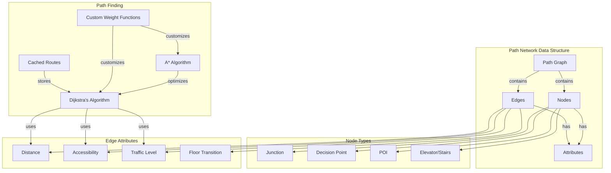

<div align="center">

# Technical Specification of LOC-INDOOR (Indoor Localisation)
</div>

<details>
<summary>Contents</summary>
<!-- TOC -->

## Table of content

<!-- TOC -->


</details>

<div align="center">


## Line-Based Floor Navigation with AR Integration

**Project Name**: Indoor Navigation System with AR Integration

**Document Version**: 1.1

**Last Updated**: March 14, 2025

**Author**: Tsangue Vivien Bistrel
</div>


# Technical Specification Document: LOC-INDOOR (Indoor Localisation)

## 1. Introduction

This document defines the technical specifications for the LOC-INDOOR indoor navigation system, which leverages Augmented Reality (AR) and Bluetooth beacon technology to provide real-time indoor navigation assistance. It serves as a reference for the development process, outlining architecture, data flow, APIs, security considerations, and deployment strategies.

### 1.1 System Overview
LOC-INDOOR is an indoor navigation application that uses Augmented Reality (AR) and Bluetooth beacon technology to solve the challenge of navigating complex indoor environments. The system provides intuitive, line-based visual guidance through a mobile application, similar to racing game waypoint systems. When users select a destination, the application displays a directional line on the floor through their device's camera view, guiding them to their chosen location.

### 1.2 Development Scope
This technical specification covers:

- Mobile application development (initially for Android, with iOS planned)
- Backend system implementation
- Bluetooth beacon integration
- AR component development
- Location tracking algorithms
- User interface implementation
- Data management and security protocols

## 2. System Architecture Implementation

### 2.1 Client-Server Architecture Overview

The system will implement a client-server architecture with three main components:

1. **Mobile Application (Client):** 
   - Developed with Unity and integrated with AR Foundation
   - Language: C# (Unity scripts)
   - Vector Graphics: Vectrosity plugin for line rendering
   - Bluetooth: Native Android Bluetooth APIs with platform-specific plugins
2. **Backend Services (Server):** 
   - RESTful API for authentication, venue data, and general requests, services built on a cloud platform
   - WebSockets for real-time navigation updates.
   - Framework: Node.js with Express
   - Database: MongoDB (venue data) and PostgreSQL (user data)
   - Authentication: JWT-based token system
   - Hosting: AWS infrastructure
3. **Infrastructure Components:** 
   - Physical Bluetooth beacons deployed within venues
   - Data Storage: AWS S3 for venue maps and assets
   - CDN: AWS CloudFront for static content delivery
   - CI/CD: GitHub Actions with automated testing

### 2.2 Architectural Implementation Flow

The implementation will follow a layered approach:

1. **Data Layer** - Database design, ORM mapping, and data access patterns
2. **Service Layer** - Business logic, positioning algorithms, and route calculations
3. **API Layer** - RESTful endpoints for client-server communication
4. **Presentation Layer** - Mobile application UI/UX and AR components


### 2.3 Required Components and Technologies
The different technologies with their roles and responsibilities in the LOC-INDOOR project:


- **Unity and C#**: Mobile application development with AR capabilities.
- **Node.js and Express**: Backend services for handling requests and APIs.
- **MongoDB and PostgreSQL**: Data storage for venues and users.
- **Bluetooth Beacons**: Indoor positioning.
- **AWS S3 and CloudFront**: Storage and delivery of static content.
- **GitHub Actions**: Automated CI/CD pipelines.
- **RESTful API and WebSockets**: Communication and real-time updates.
- **JWT and AWS Infrastructure**: Security and scalability.

Each technology plays a crucial role in ensuring the LOC-INDOOR project is robust, scalable, and provides a seamless user experience.

## 3. Mobile Application Implementation

### 3.1 Development Environment Setup

1. Install Unity 2023.1 or later with AR Foundation package
2. Configure Android SDK (minimum API level 29)
3. Set up version control with Git, including branching strategy
4. Implement CI/CD pipeline using GitHub Actions or similar service

### 3.2 AR Navigation Implementation

1. **Camera Integration**
   - Utilize AR Foundation's ARCameraManager to access device camera
   - Implement camera permission handling with graceful fallbacks
   - Configure camera settings for optimal performance in varied lighting conditions

```Pseudo-Code
   // Camera Integration
   
   FUNCTION initializeCamera()
      IF ARFoundation.ARCameraManager is available THEN
         REQUEST camera permission
         IF permission granted THEN
            CONFIGURE camera settings for optimal performance
            SET camera mode to AR
         ELSE
            DISPLAY permission error message
            PROVIDE fallback options
         ENDIF
      ELSE
         DISPLAY AR not supported message
      ENDIF
   END FUNCTION
```

2. **Line-Based Navigation Rendering**
   - Implement the Vectrosity library to draw vector lines in 3D space
   - Create a LineRenderer component that dynamically updates based on positioning data
   - Apply proper depth testing to ensure lines appear on the floor
   - Implement color gradients to indicate distance.
   - Add an animated element to indicate the destination point.

```Pseudo-Code
   //  Line-Based Navigation Rendering
   
   FUNCTION renderNavigationLine(positionData)
       INITIALIZE Vectrosity LineRenderer
       SET LineRenderer start position to current user position
       SET LineRenderer end position based on positionData
       APPLY depth testing to ensure lines appear on the floor
       SET color gradient based on distance
       ADD animated element at destination point
       UPDATE LineRenderer dynamically as positionData changes
   END FUNCTION

```

3. **Path Visualization**
   - Design path segments with distinct visual cues for different actions (straight, turn, elevator, etc.)
   - Create animated chevrons to indicate direction of travel
   - Implement distance markers at regular intervals along the path
   - Design clear visual indicators for decision points

```Pseudo-Code
   // Path Visualization
   FUNCTION visualizePath(pathSegments)
       FOR EACH segment IN pathSegments DO
           IF segment type is 'straight' THEN
               DRAW straight line segment
           ELSEIF segment type is 'turn' THEN
               DRAW curved line segment with turn indicator
           ELSEIF segment type is 'elevator' THEN
               DRAW elevator icon with direction arrow
           ENDIF
           ADD distance markers at regular intervals
           ADD animated chevrons or arrows for direction
           ADD visual indicators for decision points
       END FOR
   END FUNCTION

```

````mermaid
flowchart TD
   A[Start AR Navigation] --> B{ARCameraManager Available?}
   B -- Yes --> C[Request Camera Permission]
   B -- No --> D[Display AR Not Supported Message]
   C --> E{Permission Granted?}
   E -- Yes --> F[Configure Camera for AR]
   E -- No --> G[Display Permission Error]
   F --> H[Initialize Vectrosity LineRenderer]
   H --> I[Set LineRenderer Positions]
   I --> J[Apply Depth Testing]
   J --> K[Set Color Gradient]
   K --> L[Add Animated Destination Element]
   L --> M[Update LineRenderer Dynamically]
   M --> N[Get Path Segments from Backend]
   N --> O[Visualize Path]
   O --> P{Segment Type}
   P -- Straight --> Q[Draw Straight Line]
   P -- Turn --> R[Draw Curved Line with Turn Indicator]
   P -- Elevator --> S[Draw Elevator Icon]
   Q --> T[Add Distance Markers]
   R --> T
   S --> T
   T --> U[Add Animated Chevrons]
   U --> V[Add Decision Point Indicators]
   V --> W[Update UI with Navigation Info]
   W --> X{Navigation Active?}
   X -- Yes --> M
   X -- No --> Y[End AR Navigation]
   G --> Y
   D --> Y
````

### 3.3 Positioning System Implementation

1. **Beacon SDK Integration**
   - Implement the selected Beacon SDK (supporting AltBeacon)
   - Configure background scanning parameters to balance accuracy and battery life
   - Implement beacon region monitoring for seamless transitions

2. **Trilateration Engine**
   - Develop a positioning algorithm using signal strength from multiple beacons
   - Implement distance estimation based on RSSI (Received Signal Strength Indicator)
   - Apply Kalman filtering to smooth position data and reduce "jitter"
   - Create a position confidence score based on number and quality of beacon signals

3. **Floor Detection**
   - Design a floor transition detection algorithm using beacon identifiers
   - Implement hysteresis filtering to prevent false floor change detections
   - Create a mapping system between beacon IDs and floor numbers


### 3.4 Map Rendering Implementation

1. **Vector Map Rendering**
   - Develop a 2D map renderer that supports SVG-based floor plans
   - Implement efficient rendering for large and complex maps
   - Create a coordinate system transformation between physical and map coordinates
   - Support multi-floor visualization with floor selection UI

2. **Path Network Implementation**
   - Create a graph-based data structure for path networks
   - Implement Dijkstra's algorithm for path finding with customizable weights
   - Support path customization based on user preferences (shortest, accessible, etc.)
   - Design a caching system for common routes to improve performance



## 4. Backend Services Implementation

### 4.1 User Management Service

1. **Authentication System**
   - Implement OAuth 2.0 with support for social logins
   - Create secure password storage using bcrypt with appropriate salt
   - Develop JWT (JSON Web Token) implementation for session management
   - Design API endpoints for user registration, login, and password reset

2. **Profile Management**
   - Create database schema for user profiles
   - Implement CRUD operations for profile management
   - Design data access patterns optimized for read operations
   - Develop synchronization mechanism for offline profile changes

### 4.2 Venue Data Management

1. **CMS Implementation**
   - Develop an admin interface for venue management
   - Create import/export functionality for floor plans (supporting SVG format)
   - Implement POI management with categorization and search capabilities
   - Design beacon configuration interface with validation rules

```javascript
// Venue Data Model Schema - MongoDB Schema Design

const venueSchema = {
  _id: ObjectId,
  name: String,
  description: String,
  address: {
    street: String,
    city: String,
    state: String,
    postalCode: String,
    country: String,
    coordinates: {
      latitude: Number,
      longitude: Number
    }
  },
  operatingHours: [{
    day: String,
    open: String,
    close: String
  }],
  contact: {
    phone: String,
    email: String,
    website: String
  },
  metadata: {
    createdAt: Date,
    updatedAt: Date,
    publishedAt: Date,
    status: String // draft, published, archived
  },
  floors: [{
    _id: ObjectId,
    name: String,
    level: Number,
    floorPlanUrl: String,
    floorPlanSvg: String,
    dimensions: {
      width: Number,
      height: Number,
      unit: String
    },
    scale: Number,
    anchor: {
      x: Number,
      y: Number,
      latitude: Number,
      longitude: Number
    },
    orientation: Number,
    pathNodes: [{
      _id: ObjectId,
      type: String, // junction, poi, elevator, stair, etc.
      coordinates: {
        x: Number,
        y: Number
      },
      connections: [{
        nodeId: ObjectId,
        distance: Number,
        accessibility: {
          wheelchair: Boolean,
          visuallyImpaired: Boolean,
          hearingImpaired: Boolean
        },
        attributes: {
          trafficLevel: Number,
          isEmergencyRoute: Boolean
        }
      }]
    }],
    beacons: [{
      _id: ObjectId,
      uuid: String,
      major: Number,
      minor: Number,
      name: String,
      coordinates: {
        x: Number,
        y: Number
      },
      batteryLevel: Number,
      lastChecked: Date,
      status: String // active, inactive, maintenance
    }],
    pointsOfInterest: [{
      _id: ObjectId,
      name: String,
      description: String,
      category: String,
      subcategory: String,
      coordinates: {
        x: Number,
        y: Number
      },
      icon: String,
      metadata: {
        popularity: Number,
        tags: [String]
      }
    }]
  }]
};

const poiCategorySchema = {
  _id: ObjectId,
  name: String,
  icon: String,
  color: String,
  subcategories: [{
    name: String,
    icon: String
  }]
};

const routeTemplateSchema = {
  _id: ObjectId,
  venueId: ObjectId,
  name: String,
  description: String,
  type: String, // guided tour, emergency, etc.
  waypoints: [{
    poiId: ObjectId,
    order: Number,
    estimatedDuration: Number
  }]
};

```

2. **Data Synchronization**
   - Create a differential update system to minimize data transfer
   - Implement version control for venue data to support rollbacks
   - Develop a notification system for client applications when updates are available
   - Design a caching strategy for venue data

### 4.3 Analytics Service

1. **Data Collection**
   - Implement anonymous usage tracking
   - Design event-based logging system for navigation sessions
   - Create aggregation pipelines for traffic analysis
   - Develop heatmap generation for venue utilization

2. **Reporting Engine**
   - Create dashboards for venue administrators
   - Implement scheduled report generation
   - Design visualization components for traffic patterns
   - Develop API endpoints for custom analytics queries

````svg
<svg xmlns="http://www.w3.org/2000/svg" viewBox="0 0 800 600">
  <!-- Dashboard Background -->
  <rect width="800" height="600" fill="#f8f9fa" rx="5" ry="5"/>
  
  <!-- Header -->
  <rect x="0" y="0" width="800" height="60" fill="#4a6fd8" rx="5" ry="5"/>
  <text x="20" y="38" font-family="Arial" font-size="24" font-weight="bold" fill="white">LOC-INDOOR Analytics Dashboard</text>
  
  <!-- Navigation Menu -->
  <rect x="0" y="60" width="160" height="540" fill="#ffffff" stroke="#e0e0e0" stroke-width="1"/>
  <text x="20" y="90" font-family="Arial" font-size="14" fill="#333333" font-weight="bold">Navigation</text>
  <rect x="10" y="100" width="140" height="30" fill="#e8eeff" rx="3" ry="3"/>
  <text x="20" y="120" font-family="Arial" font-size="12" fill="#4a6fd8">Overview</text>
  <text x="20" y="150" font-family="Arial" font-size="12" fill="#666666">Traffic Analysis</text>
  <text x="20" y="180" font-family="Arial" font-size="12" fill="#666666">Heat Maps</text>
  <text x="20" y="210" font-family="Arial" font-size="12" fill="#666666">User Journeys</text>
  <text x="20" y="240" font-family="Arial" font-size="12" fill="#666666">POI Analytics</text>
  <text x="20" y="270" font-family="Arial" font-size="12" fill="#666666">System Status</text>
  
  <!-- Main Content -->
  <rect x="170" y="70" width="620" height="100" fill="#ffffff" stroke="#e0e0e0" stroke-width="1" rx="5" ry="5"/>
  <text x="190" y="100" font-family="Arial" font-size="18" fill="#333333" font-weight="bold">Venue Traffic Overview</text>
  
  <!-- KPI Cards -->
  <rect x="190" y="120" width="120" height="40" fill="#e8eeff" rx="3" ry="3"/>
  <text x="200" y="140" font-family="Arial" font-size="10" fill="#666666">TOTAL VISITORS</text>
  <text x="200" y="155" font-family="Arial" font-size="16" fill="#333333" font-weight="bold">8,942</text>
  
  <rect x="320" y="120" width="120" height="40" fill="#e8eeff" rx="3" ry="3"/>
  <text x="330" y="140" font-family="Arial" font-size="10" fill="#666666">AVG. VISIT DURATION</text>
  <text x="330" y="155" font-family="Arial" font-size="16" fill="#333333" font-weight="bold">32 min</text>
  
  <rect x="450" y="120" width="120" height="40" fill="#e8eeff" rx="3" ry="3"/>
  <text x="460" y="140" font-family="Arial" font-size="10" fill="#666666">PEAK HOURS</text>
  <text x="460" y="155" font-family="Arial" font-size="16" fill="#333333" font-weight="bold">12-2 PM</text>
  
  <rect x="580" y="120" width="120" height="40" fill="#e8eeff" rx="3" ry="3"/>
  <text x="590" y="140" font-family="Arial" font-size="10" fill="#666666">NAVIGATION SESSIONS</text>
  <text x="590" y="155" font-family="Arial" font-size="16" fill="#333333" font-weight="bold">5,327</text>
  
  <!-- Traffic Chart -->
  <rect x="170" y="180" width="400" height="220" fill="#ffffff" stroke="#e0e0e0" stroke-width="1" rx="5" ry="5"/>
  <text x="190" y="210" font-family="Arial" font-size="16" fill="#333333" font-weight="bold">Hourly Traffic</text>
  
  <!-- Chart Lines -->
  <polyline points="190,350 210,340 230,300 250,320 270,310 290,290 310,280 330,260 350,280 370,290 390,310 410,330 430,340 450,330 470,320 490,330 510,320 530,335 550,350" fill="none" stroke="#4a6fd8" stroke-width="2"/>
  
  <!-- Chart Axis -->
  <line x1="190" y1="350" x2="570" y2="350" stroke="#cccccc" stroke-width="1"/>
  <line x1="190" y1="350" x2="190" y2="230" stroke="#cccccc" stroke-width="1"/>
  
  <!-- Hour Labels -->
  <text x="210" y="365" font-family="Arial" font-size="8" fill="#666666">9AM</text>
  <text x="250" y="365" font-family="Arial" font-size="8" fill="#666666">10AM</text>
  <text x="290" y="365" font-family="Arial" font-size="8" fill="#666666">11AM</text>
  <text x="330" y="365" font-family="Arial" font-size="8" fill="#666666">12PM</text>
  <text x="370" y="365" font-family="Arial" font-size="8" fill="#666666">1PM</text>
  <text x="410" y="365" font-family="Arial" font-size="8" fill="#666666">2PM</text>
  <text x="450" y="365" font-family="Arial" font-size="8" fill="#666666">3PM</text>
  <text x="490" y="365" font-family="Arial" font-size="8" fill="#666666">4PM</text>
  <text x="530" y="365" font-family="Arial" font-size="8" fill="#666666">5PM</text>
  
  <!-- Popular POIs -->
  <rect x="580" y="180" width="210" height="220" fill="#ffffff" stroke="#e0e0e0" stroke-width="1" rx="5" ry="5"/>
  <text x="600" y="210" font-family="Arial" font-size="16" fill="#333333" font-weight="bold">Popular POIs</text>
  
  <!-- POI List -->
  <rect x="600" y="230" width="170" height="20" fill="#e8eeff" rx="2" ry="2"/>
  <text x="610" y="245" font-family="Arial" font-size="12" fill="#333333">Main Entrance</text>
  <text x="730" y="245" font-family="Arial" font-size="12" fill="#4a6fd8" font-weight="bold">1,453</text>
  
  <rect x="600" y="260" width="170" height="20" fill="#f8f9fa" rx="2" ry="2"/>
  <text x="610" y="275" font-family="Arial" font-size="12" fill="#333333">Food Court</text>
  <text x="730" y="275" font-family="Arial" font-size="12" fill="#4a6fd8" font-weight="bold">1,128</text>
  
  <rect x="600" y="290" width="170" height="20" fill="#e8eeff" rx="2" ry="2"/>
  <text x="610" y="305" font-family="Arial" font-size="12" fill="#333333">Electronics (Floor 2)</text>
  <text x="730" y="305" font-family="Arial" font-size="12" fill="#4a6fd8" font-weight="bold">952</text>
  
  <rect x="600" y="320" width="170" height="20" fill="#f8f9fa" rx="2" ry="2"/>
  <text x="610" y="335" font-family="Arial" font-size="12" fill="#333333">Customer Service</text>
  <text x="730" y="335" font-family="Arial" font-size="12" fill="#4a6fd8" font-weight="bold">847</text>
  
  <rect x="600" y="350" width="170" height="20" fill="#e8eeff" rx="2" ry="2"/>
  <text x="610" y="365" font-family="Arial" font-size="12" fill="#333333">Restrooms (Floor 1)</text>
  <text x="730" y="365" font-family="Arial" font-size="12" fill="#4a6fd8" font-weight="bold">723</text>
  
  <!-- Heatmap -->
  <rect x="170" y="410" width="620" height="180" fill="#ffffff" stroke="#e0e0e0" stroke-width="1" rx="5" ry="5"/>
  <text x="190" y="440" font-family="Arial" font-size="16" fill="#333333" font-weight="bold">Traffic Heatmap</text>
  
  <!-- Simplified Floor Plan -->
  <rect x="190" y="450" width="580" height="120" fill="#f8f9fa" stroke="#cccccc" stroke-width="1"/>
  
  <!-- Heatmap Overlay (Gradient Areas) -->
  <circle cx="250" cy="480" r="40" fill="#ff0000" opacity="0.2"/>
  <circle cx="350" cy="510" r="30" fill="#ff0000" opacity="0.3"/>
  <circle cx="450" cy="490" r="35" fill="#ff0000" opacity="0.4"/>
  <circle cx="550" cy="520" r="25" fill="#ff0000" opacity="0.3"/>
  <circle cx="650" cy="480" r="30" fill="#ff0000" opacity="0.2"/>
  
  <!-- Legend -->
  <text x="190" y="590" font-family="Arial" font-size="10" fill="#666666">Low Traffic</text>
  <rect x="250" y="582" width="20" height="10" fill="#ff0000" opacity="0.2"/>
  <rect x="280" y="582" width="20" height="10" fill="#ff0000" opacity="0.3"/>
  <rect x="310" y="582" width="20" height="10" fill="#ff0000" opacity="0.4"/>
  <text x="340" y="590" font-family="Arial" font-size="10" fill="#666666">High Traffic</text>
</svg>
````


## 5. Infrastructure Components Implementation

### 5.1 Bluetooth Beacon Deployment

1. **Beacon Selection**
    - Select beacons based on battery life, signal stability, and transmission range
    - Ensure compatibility with both iBeacon and Eddystone protocols
    - Verify firmware update capabilities
    - Test signal consistency in various environmental conditions

2. **Deployment Strategy**
    - Calculate optimal beacon placement using coverage modeling
    - Target placement density of 1 beacon per 100-150 square meters
    - Prioritize placement near decision points (intersections, elevators)
    - Develop a beacon testing and validation process

3. **Beacon Management**
    - Implement a beacon health monitoring system
    - Create a unique identification scheme for beacons (including floor information)
    - Design a battery replacement schedule based on usage patterns
    - Develop a beacon firmware update process

### 5.2 Cloud Infrastructure Implementation

1. **Database Design**
    - Implement PostgreSQL for relational data (user profiles, analytics)
    - Utilize MongoDB for venue data (maps, POIs, path networks)
    - Create appropriate indexing strategy for query optimization
    - Implement database sharding for high-traffic venues

2. **API Gateway**
    - Develop RESTful API with OpenAPI specification
    - Implement rate limiting and request throttling
    - Create comprehensive API documentation
    - Design API versioning strategy

3. **Content Delivery Network**
    - Configure CDN for static assets (map tiles, images)
    - Implement regional edge caching for faster asset delivery
    - Design cache invalidation strategy for updated content
    - Create fallback mechanisms for CDN failures

## 6. Positioning Algorithm Implementation

### 6.1 Trilateration Algorithm

1. **Signal Processing**
    - Implement RSSI to distance conversion using environmental calibration
    - Create signal strength filtering to remove outliers
    - Develop signal smoothing using exponential moving average
    - Design adaptive signal processing based on movement patterns

2. **Position Calculation**
    - Implement weighted trilateration using 3+ beacons
    - Create confidence scoring based on beacon geometry and signal quality
    - Develop position history tracking for movement prediction
    - Implement dead reckoning for areas with limited beacon coverage

3. **Kalman Filter Implementation**
    - Design a state transition model for user movement
    - Implement measurement update using beacon signals
    - Create adaptive noise parameters based on signal quality
    - Develop a convergence detection algorithm for stable positioning

### 6.2 Path Finding Implementation

1. **Graph Construction**
    - Create a directed weighted graph representation of walkable paths
    - Implement node attributes for special locations (elevators, stairs)
    - Design edge attributes for path properties (width, accessibility)
    - Develop a graph serialization format for efficient storage and transmission

2. **Routing Algorithm**
    - Implement Dijkstra's algorithm for shortest path calculation
    - Create custom cost functions for different user preferences
    - Develop A* algorithm implementation for improved performance
    - Design route caching strategy for common destinations

3. **Multi-floor Pathfinding**
    - Implement vertical connection nodes for floor transitions
    - Create special handling for elevators and escalators
    - Design path visualization for floor changes
    - Develop floor transition detection and guidance

## 7. User Interface Implementation

### 7.1 Onboarding Flow

1. **First Launch Experience**
    - Design progressive permission requests with clear explanations
    - Create interactive tutorial explaining AR navigation concepts
    - Implement account creation and login screens
    - Develop preference setup for accessibility options

2. **Venue Selection**
    - Implement nearby venue detection
    - Create venue search functionality with filters
    - Design venue information display with details and operating hours
    - Implement venue favorites and recent visits

### 7.2 Destination Selection

1. **Search Implementation**
    - Create search index for POIs with autocomplete
    - Implement fuzzy matching for search terms
    - Design category-based browsing interface
    - Develop recent and favorite destinations display

2. **Map Interaction**
    - Implement tap-to-select POI functionality
    - Create map panning and zooming with gesture control
    - Design multi-floor selection interface
    - Develop POI details display with actionable information

### 7.3 AR Navigation View

1. **Camera View Integration**
    - Implement camera preview with proper aspect ratio handling
    - Create camera permission handling with fallback options
    - Design orientation changes handling
    - Develop AR session management with pause/resume functionality

2. **Navigation Overlay**
    - Implement line rendering on the floor with proper perspective
    - Create distance and ETA indicators
    - Design turn notifications and decision point guidance
    - Develop floor change indicators for multi-floor navigation

3. **Information Display**
    - Implement heads-up display for navigation information
    - Create notification system for nearby POIs
    - Design accessibility information display
    - Develop contextual help system

## 8. Accessibility Implementation

### 8.1 Visual Accessibility

1. **High Contrast Mode**
    - Implement alternative color schemes for color-blind users
    - Create large text mode with simplified UI
    - Design high contrast navigation lines with customizable appearance
    - Develop screen reader compatibility for all UI elements

2. **Reduced Motion**
    - Implement static alternatives to animations
    - Create simplified visual cues for direction
    - Design reduced update frequency for sensitive users
    - Develop alternative navigation modes for users with motion sensitivity

### 8.2 Mobility Accessibility

1. **Route Preferences**
    - Implement elevator-only route options
    - Create wider path preference for wheelchair users
    - Design route avoidance for stairs and escalators
    - Develop custom routing cost functions based on mobility profile

2. **Assistance Features**
    - Implement voice guidance synchronized with visual cues
    - Create haptic feedback for direction changes
    - Design emergency assistance location feature
    - Develop accessibility information for venues and POIs

## 9. Integration Implementation

### 9.1 Map Integration

1. **Floor Plan Processing**
    - Develop SVG parser for floor plans
    - Create coordinate system transformation
    - Implement layer extraction for different map elements
    - Design POI placement validation

2. **Path Network Generation**
    - Implement automatic path network generation from floor plans
    - Create manual path editing tools for venue administrators
    - Design path validation ensuring complete connectivity
    - Develop multi-floor connection validation

### 9.2 External System Integration

1. **Venue Management Systems**
    - Create API adapters for popular venue management systems
    - Implement data synchronization protocols
    - Design conflict resolution for concurrent updates
    - Develop webhooks for real-time updates

2. **Social Media Integration**
    - Implement sharing functionality for locations
    - Create venue check-in options
    - Design social features for favorite places
    - Develop friend location sharing with privacy controls

## 10. Security Implementation

### 10.1 Data Security

1. **Encryption Implementation**
    - Utilize AES-256 for sensitive data storage
    - Implement TLS 1.3 for all network communications
    - Create secure key management with proper rotation
    - Design end-to-end encryption for sensitive user data

2. **Privacy Controls**
    - Implement data minimization principles
    - Create privacy settings with granular controls
    - Design data retention policies with automatic cleanup
    - Develop anonymization for analytics data

### 10.2 Beacon Security

1. **Anti-Spoofing Measures**
    - Implement beacon authentication mechanism
    - Create rotating identifiers for beacons
    - Design signal validation to detect anomalies
    - Develop intrusion detection for beacon networks

2. **Secure Provisioning**
    - Implement secure beacon registration process
    - Create beacon ownership verification
    - Design secure firmware update process
    - Develop tamper detection for physical beacons

## 11. Testing Implementation

### 11.1 Test Environment Setup

1. **Beacon Testing Lab**
    - Create controlled environment with known beacon positions
    - Implement signal strength measurement tools
    - Design automated testing for positioning accuracy
    - Develop environmental variation simulation

2. **Simulated Navigation**
    - Implement virtual user movement for testing
    - Create scripted navigation scenarios
    - Design edge case testing for complex venues
    - Develop performance benchmarking tools

### 11.2 Testing Methodologies

1. **Unit Testing**
    - Implement automated tests for core algorithms
    - Create test coverage targets (minimum 80%)
    - Design mock objects for external dependencies
    - Develop continuous integration testing

2. **Integration Testing**
    - Implement end-to-end testing scenarios
    - Create real-world testing protocols
    - Design A/B testing for UI variations
    - Develop load testing for backend services

3. **User Testing**
    - Create usability testing protocols
    - Implement analytics collection during beta testing
    - Design feedback mechanisms for testers
    - Develop iterative improvement process based on user feedback

## 12. Deployment Strategy

### 12.1 Mobile Application Deployment

1. **Release Pipeline**
    - Create staged rollout strategy for app stores
    - Implement feature flags for controlled feature releases
    - Design beta testing program with TestFlight and Google Play Beta
    - Develop automated build and submission process

2. **Version Management**
    - Implement semantic versioning strategy
    - Create update notification system
    - Design backward compatibility for API changes
    - Develop forced update mechanism for critical issues

### 12.2 Backend Deployment

1. **Infrastructure as Code**
    - Implement Terraform for cloud infrastructure management
    - Create Docker containers for service components
    - Design Kubernetes deployment for scalability
    - Develop blue/green deployment strategy for zero downtime

2. **Monitoring and Alerting**
    - Implement comprehensive logging with structured format
    - Create performance monitoring dashboards
    - Design alerting thresholds with appropriate escalation
    - Develop automated recovery procedures where possible

### 12.3 Beacon Infrastructure Deployment

1. **Site Survey**
    - Create venue measurement and mapping process
    - Implement signal propagation modeling
    - Design optimal beacon placement algorithm
    - Develop installation guidelines and documentation

2. **Deployment Validation**
    - Implement beacon coverage testing
    - Create positioning accuracy verification
    - Design beacon health monitoring
    - Develop maintenance schedules and procedures

## 13. Performance Optimization

### 13.1 Mobile Application Optimization

1. **Battery Usage**
    - Implement adaptive beacon scanning based on movement
    - Create efficient rendering for AR components
    - Design background processing limitations
    - Develop power usage monitoring and optimization

2. **Memory Management**
    - Implement resource pooling for frequently used objects
    - Create dynamic asset loading based on vicinity
    - Design efficient data structures for positioning
    - Develop memory usage monitoring and alerts

### 13.2 Backend Optimization

1. **Database Performance**
    - Implement query optimization with proper indexing
    - Create read replicas for high-traffic scenarios
    - Design data partitioning strategy
    - Develop query caching with appropriate invalidation

2. **API Optimization**
    - Implement response compression
    - Create efficient serialization formats
    - Design connection pooling and reuse
    - Develop API response caching with CDN integration

## 14. Maintenance and Support

### 14.1 System Monitoring

1. **Performance Monitoring**
    - Implement real-time performance dashboards
    - Create automated performance testing
    - Design performance degradation alerts
    - Develop trend analysis for capacity planning

2. **Health Monitoring**
    - Implement service health checks
    - Create beacon network monitoring
    - Design system status dashboard for operations team
    - Develop proactive maintenance alerts

### 14.2 User Support

1. **Help System**
    - Implement in-app help documentation
    - Create contextual help based on user actions
    - Design video tutorials for common tasks
    - Develop chatbot assistance for troubleshooting

2. **Feedback Management**
    - Implement in-app feedback collection
    - Create issue tracking and resolution process
    - Design automated response for common issues
    - Develop feature request management system

## 15. Future Expansion Considerations

1. **Platform Expansion**
    - Prepare code structure for iOS implementation
    - Design cross-platform component architecture
    - Create platform-specific optimizations
    - Develop shared codebase management strategy

2. **Feature Expansion**
    - Design architecture for multi-destination planning
    - Implement framework for augmented POI information
    - Create integration points for additional services
    - Develop extensible plugin architecture for future features

3. **Scalability Planning**
    - Design database sharding strategy for growth
    - Implement horizontal scaling for backend services
    - Create load balancing for distributed deployment
    - Develop performance benchmarks for capacity planning

## 16. Documentation

### 16.1 Development Documentation

1. **API Documentation**
    - Create comprehensive API reference
    - Implement OpenAPI specification
    - Design interactive API playground
    - Develop code examples for common operations

2. **Architecture Documentation**
    - Create system architecture diagrams
    - Implement component interaction documentation
    - Design data flow documentation
    - Develop decision record for architectural choices

### 16.2 Operational Documentation

1. **Deployment Guides**
    - Create step-by-step deployment instructions
    - Implement environment setup documentation
    - Design troubleshooting guides
    - Develop rollback procedures

2. **Maintenance Procedures**
    - Implement routine maintenance documentation
    - Create emergency response procedures
    - Design backup and recovery documentation
    - Develop performance tuning guidelines

## 17. Conclusion

This technical specification document provides the detailed implementation guidance needed to develop the LOC-INDOOR system. Each section outlines the specific approach to be taken for different components of the system, ensuring that developers have clear direction on how to implement the features described in the functional specification. The document aims to be comprehensive while avoiding excessive code examples, focusing instead on the technical approach and implementation strategy.